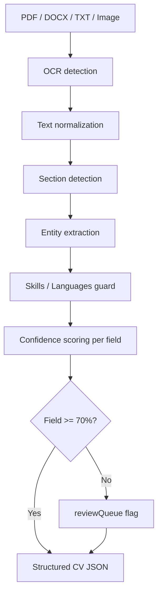

# CV_EXTRACTION_REPORT

**Status:** PASS
**Engine:** `EXTRACTION_ENGINE_V2`
**Generated:** 2026-06-14T13:53:08.324Z
**Review threshold:** **70%** — any field below must enter `reviewQueue`

## Executive summary

| Metric | Value |
|--------|------:|
| Fixtures tested | 15 |
| **Success rate** | **100%** |
| Partial (flagged fields) | 0% |
| **Failure rate** | **0%** |
| QA checks | 27/27 |

## Pipeline (V2)



## Detected entities

| Category | Fields |
|----------|--------|
| Identity | name, title, location, email, phone, website, LinkedIn |
| Career | experience (role, company, dates, bullets) |
| Education | schools, degrees, dates |
| Skills | skills, tools (software guard) |
| Languages | language + proficiency (strict extractor) |
| Other | certifications, projects, achievements, clients |

## Confidence by section

| Section | Avg confidence | Flagged items | Samples |
|---------|---------------:|--------------:|--------:|
| email | 100% | 0 | 15 |
| experience | 100% | 0 | 67 |
| phone | 96% | 0 | 14 |
| languages | 92% | 0 | 12 |
| summary | 90% | 0 | 12 |
| education | 86% | 4 | 46 |
| tools | 85% | 0 | 12 |
| skills | 81% | 2 | 26 |
| projects | 81% | 0 | 17 |
| name | 33% | 10 | 15 |

## Fixture results

| Fixture | Outcome | Overall conf. | Flagged | Experience rows | Sections |
|---------|---------|--------------:|--------:|----------------:|---------:|
| creative-cv | success | 86% | 1 | 5 | 10 |
| yoaz-cv | success | 89% | 1 | 24 | 11 |
| consultant-cv | success | 87% | 1 | 3 | 8 |
| developer-cv | success | 87% | 1 | 4 | 9 |
| marketing-cv | success | 86% | 1 | 3 | 9 |
| recruiter-cv | success | 84% | 1 | 2 | 9 |
| student-cv | success | 80% | 2 | 2 | 8 |
| executive-cv | success | 95% | 0 | 4 | 7 |
| two-column-cv | success | 81% | 1 | 1 | 7 |
| academic-cv | success | 84% | 2 | 4 | 8 |
| scanned-pdf | success | 87% | 1 | 5 | 7 |
| text-pdf | success | 83% | 1 | 2 | 7 |
| docx | success | 83% | 1 | 2 | 7 |
| image-cv | success | 83% | 1 | 3 | 7 |
| sales-cv | success | 86% | 1 | 3 | 9 |

## Modules

| File | Role |
|------|------|
| `src/core/extraction/extraction-engine-v2.js` | V2 orchestrator |
| `src/core/extraction/field-confidence-v2.js` | Per-field scoring + 70% gate |
| `src/core/extraction/skills-languages-guard.js` | Skills ↔ languages separation |
| `src/core/parsing/ocr-postprocess.js` | Text normalization / OCR repair |
| `src/core/parsing/section-engine-v2.js` | Section detection |
| `src/core/parsing/identity-extraction.js` | Identity entities |
| `src/core/pipeline/production-pipeline.js` | Production parse + V2 post-process |

## Known failure modes

| Issue | Mitigation |
|-------|------------|
| Wrong sections | `section-engine-v2` + semantic inference |
| Broken words | `postProcessOcrText` + creative entity guard |
| Missing experiences | experience recovery + anchor extract |
| Incorrect dates | `repairOcrYearTokens` + date parsers |
| Skills mixed with languages | `skills-languages-guard.js` |
| Low-confidence fields | `field-confidence-v2` → reviewQueue |

## Review flags (honest gaps)

Fields below **70%** are pushed to `reviewQueue` and never auto-rendered in preview.

| Section | Avg confidence | Still flagged across corpus |
|---------|---------------:|----------------------------:|
| name | 33% | 10 |
| education | 86% | 4 |
| skills | 81% | 2 |

**Weakest area:** `name` extraction on OCR/scanned fixtures — names often need manual review even when experience/education parse correctly.

## Regenerate

```bash
node src/tests/qa-extraction-engine-v2.mjs
node scripts/cv-extraction-report.mjs
# or
npm run cv-extraction:report
```
