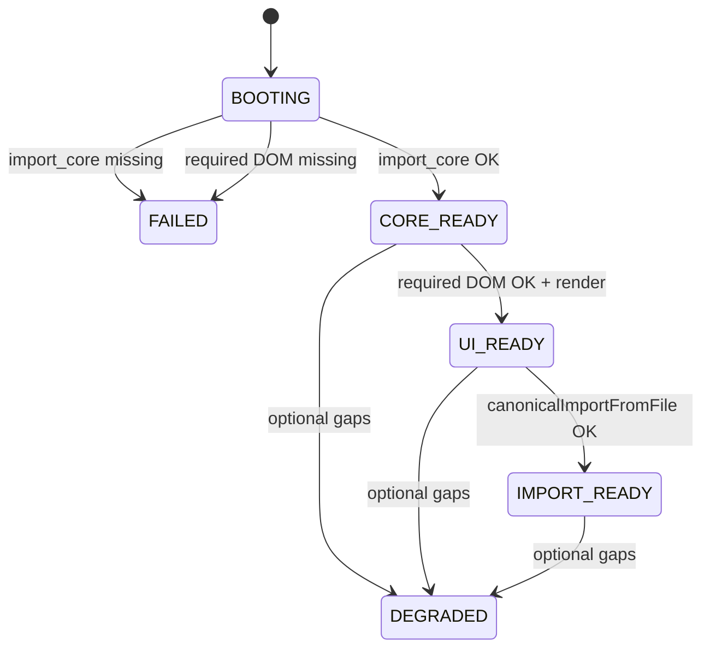

# ENGINE_HEALTH_POLICY

**Policy version:** `ENGINE_HEALTH_POLICY_V1`  
**Implementation:** `src/ui/runtime/engine-health.js`  
**UI integration:** `index.html` (`showHirelyCoreLoadError`, `reportHirelyCoreStatus`, boot sequence)

## States

| State | Meaning | Production banner |
|-------|---------|-------------------|
| `BOOTING` | Core/UI still initializing | None |
| `CORE_READY` | Required import pipeline loaded (`import_core`) | None |
| `UI_READY` | Required DOM present; shell rendered | None |
| `IMPORT_READY` | File + text import surfaces available | None |
| `DEGRADED` | Optional module or optional DOM gap | None (console + debug overlay only) |
| `FAILED` | Required core or required DOM missing | Red `#hirelyCoreLoadError` banner |

## Classification rules

### FAILED (blocking)

- `import_core` missing: no `runHirelyImportFromText` / `resumeDataMeetsImportMinimum`, or `__hirelyFallback` stub
- Any **required DOM** from `HirelyDomContract.REQUIRED_DOM_IDS` missing after validation
- Full + minimal core loaders both fail

### DEGRADED (non-blocking)

- Optional core modules missing (`file_import`, `review_queue`, `fact_extraction`, `section_engine`, `resume_graph`, `identity_extraction`, `ocr_pipeline`)
- Optional DOM targets missing (logged via `MISSING_DOM_TARGET` / `__HIRELY_MISSING_DOM__`)
- Minimal tier boot (`__hirelyDegraded`, `tier: minimal`)
- Extraction/parser gaps **before first user import** — product remains usable via paste/file where available

### Ignored (no health impact)

- Debug panels: `hirelyDebugPanel`, `hirelyForensicPanel`, `importDebugPanel`, `pipelineReportPanel`, test hooks
- `templateGallery` absent on Review step (expected in P0 UI)
- `MISSING_DOM_TARGET` trace entries for the above

## Banner policy

```
if state === FAILED:
  show red hirelyCoreLoadError (localized coreLoadFail)
  block import zone (wsImport--coreBlocked)

if state === DEGRADED:
  production: hide banner
  console.warn('HIRELY_ENGINE_DEGRADED', reasons)
  debug (?debug=1): optional amber banner in overlay only

else:
  hide banner, unblock import
```

**Never** call `showHirelyCoreLoadError` for:

- Boot still in progress (`BOOTING`)
- Optional panel removal
- Degraded optional modules when `import_core` is OK
- `renderOutputs` / `renderAll` skipping optional targets

## State progression



## Globals (debug)

- `window.__HIRELY_ENGINE_HEALTH__` — `{ state, reasons, signals, importCapable, at }`
- `window.__HIRELY_ENGINE_HEALTH_STATE__` — shorthand state string
- `window.HirelyEngineHealth` — API: `evaluate`, `applyUi`, `markUiReady`, `onCoreStatus`, `isFailed`, `isImportAllowed`

## QA

```bash
npm run qa:engine-health
npm run qa:boot
```

- `qa:engine-health` proves optional DOM removal does **not** surface the red failure banner and does **not** set `FAILED` (production URL, no `?debug=1`).
- `qa:boot` optional_dom scenario runs with `?debug=1`; amber degraded banner is allowed there — red failure banner is not.

## Related contracts

- `src/ui/runtime/dom-contract.js` — required vs optional DOM
- `src/core/boot/boot-contract.mjs` — required vs optional core features
