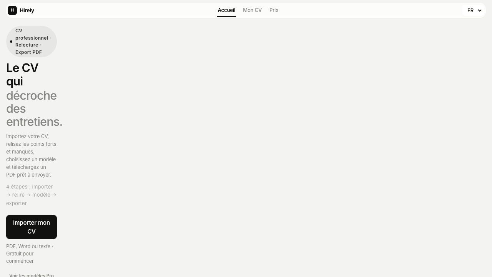

# FINAL_BOOT_DOM_CONTRACT_REPORT

**Status:** PASS
**Generated:** 2026-06-15T11:13:45.697Z

## Summary

Locked runtime after P0 UI subtraction: canonical `hirelyTrace`, DOM-safe writes, required vs optional contract, resilient `renderOutputs` / `renderAll`, engine banner only on `FAILED`.

| Check | Result |
|-------|--------|
| trace_hirelyTrace_survives_object_seed | PASS |
| boot_trace_module_loaded | PASS |
| dom_safe_loaded | PASS |
| dom_contract_loaded | PASS |
| required_dom_present | PASS — ok |
| render_outputs_shape | PASS — {"ok":true,"rendered":[],"skipped":["auditPanelInner","linkedinText","letterText"],"missingRequired":[]} |
| render_outputs_no_throw | PASS |
| render_all_safe_phases | PASS |
| engine_not_failed | PASS — engine=IMPORT_READY; core=ok |
| failure_banner_hidden_unless_failed | PASS — hidden=true; degraded=false |
| drop_hint_not_raw_key | PASS — Glissez votre fichier ici, ou cliquez pour choisir un fichier. |
| drop_hint_correct_fr | PASS — Glissez votre fichier ici, ou cliquez pour choisir un fichier. |
| import_controls_present | PASS |
| cv_preview_present | PASS |
| no_console_type_errors | PASS — clean |

## Required DOM (`REQUIRED_DOM_IDS`)

- `app`
- `docNav`
- `wsImport`
- `drop`
- `fileInput`
- `cvPreview` (live element: `#cvDoc`)

## Optional DOM

All removed debug / recruiter / extraction / export / letter / template bars — missing → `MISSING_OPTIONAL_DOM` trace only, never `FAILED`.

## Direct `__HIRELY_CORE_BOOT_TRACE__.push` replacements

- src/ui/runtime/boot-trace.js — hirelyTrace() (canonical; replaces direct .push)
- src/ui/runtime/dom-safe.js — hirelyTrace() delegate
- src/ui/runtime/dom-contract.js — hirelyTrace() / pushBootTrace alias
- index.html — hirelyTrace() / safeBootTrace (no direct .push)
- index.html — getHirelyCore onStep → hirelyTrace(step)
- scripts/qa-boot-regression.mjs — hirelyTrace for probe (fallback array only in QA)
- scripts/qa-no-regression-repair.mjs — hirelyTrace after object seed

## Null `innerHTML` / `textContent` guards

- src/ui/runtime/dom-safe.js — setHTML(), setText()
- src/ui/runtime/dom-contract.js — setHTML(), setText(), setElHTML()
- index.html — setHTML(), setText(), setElHTML(), trackRenderHtml()
- index.html — renderOutputs() — trackRenderHtml for optional auditPanelInner
- index.html — renderAll() — safePhase() per section, no throw on optional gaps

## Screenshot

## Manual checklist

- [ ] Hard refresh
- [ ] Console clear — no TypeError
- [ ] Import button
- [ ] File drop
- [ ] Paste fallback
- [ ] Review step
- [ ] Style step
- [ ] Export step
