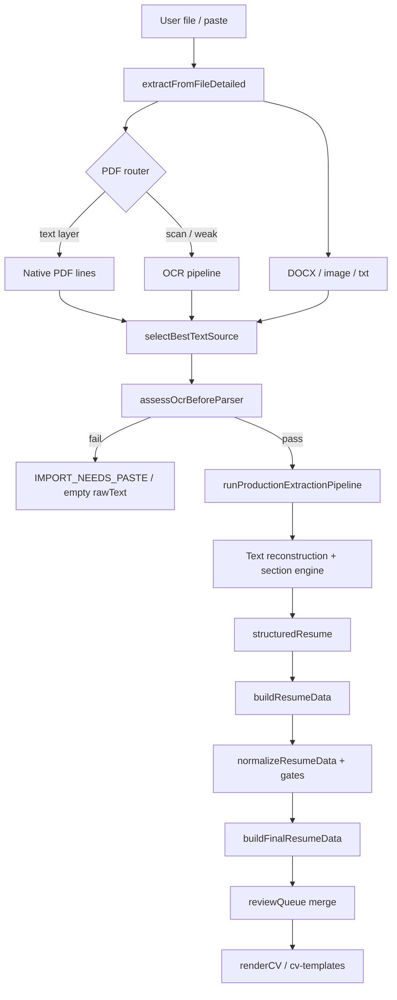

# HIRELY SYSTEMIC IMPORT AUDIT

**Mission:** Explain why Hirely works on the known Yoaz CV but fails on many other real CVs.  
**Mode:** Audit only — no fixes in this document.  
**Generated:** 2026-06-12  
**Engine reference:** `HIRELY_FLOW_LOCK_V3` → `PIPELINE_MAP.md`

---

## Executive summary

Yoaz is **not** special-cased in product code (`src/core` has zero `yoaz` / `Yohann` / `Azancot` hardcodes). It passes because:

1. **Text quality** — The canonical fixture is a **clean, sectioned, paste-friendly** creative CV (~2.5k chars) with explicit headers (`Experience`, `Education`, `Profile`) and dictionary-friendly entities (LISAA, Nike, Adobe, McCann).
2. **Classification fit** — Yoaz structure matches the **creative/agency** parsers and golden classification locks (`tests/golden/yoaz-cv-classification.json`).
3. **Identity safety** — Header name `Yohann Azancot` does **not** get mis-parsed as an experience `company` row, so anti-fake-name guards do not strip it.
4. **QA path bias** — Most Yoaz PASS evidence uses **TXT paste**, **generated selectable PDFs**, or **fixture runners** — not the user’s original scanned/uploaded PDF.

Other real CVs fail at different layers:

| Failure class | Typical symptom | Honest status? |
|---------------|-----------------|----------------|
| **Extraction** | Scanned/image PDF → 0 chars | ✓ `IMPORT_NEEDS_PASTE` |
| **OCR gate** | Weak OCR → parser blocked | ✓ but harsh |
| **Layout** | Two-column / Canva / DOCX tables → shuffled lines | Partial — text exists, structure wrong |
| **Misclassification** | Name line → `company` in experience | ✗ — triggers name collision → empty identity |
| **Over-gating** | `resumeData` rich → `finalResumeData` thin | ✗ — looks “imported” but preview empty |
| **Fake success** | `IMPORT_READY` + ~45 char preview, 0 exp | ✗ — `ready_no_structure` |

### Live gate snapshot (this repo, 2026-06-12)

| Gate | Result | Notes |
|------|--------|-------|
| `golden:yoaz` | **PASS** | Classification mappings only |
| `qa:generalization-proof` (10 non-Yoaz TXT) | **2/10 PASS** | Identity cleared by employer collision on many corpora |
| `REAL_WORLD_IMPORT_TRUTH_REPORT` | **FAIL** | 2× `IMPORT_READY` without structure (`columns-developer.docx`, `developer-legacy.doc`) |
| `PRODUCTION_REALITY_AUDIT` (H17) | **FAIL** | Real browser PDF upload → 0 raw chars for Yoaz PDF too |
| `IMPORT_REALITY_CHECK_REPORT` | **PASS** | Harness-generated selectable PDF/DOCX/TXT |
| `qa:no-fake-data-policy` | **PASS** | Empty/wrong identity policy holds when audited |

**Bottom line:** Yoaz “works” on the **structured-text path**. The **real upload path** (especially scanned PDF) fails for Yoaz the same as for other users. Non-creative, single-column English CVs often fail later because **experience parsing poisons identity**.

---

## Pipeline map



---

## Stage-by-stage audit

For each stage: **input → output → failure modes → fallback → data loss → fake data → honest status**.

---

### 1. File import

| | |
|--|--|
| **Entry** | `index.html` `handleFileImport` → `canonicalImportFromFile` / `runHirelyImportFromFile` (`hirely-import.js`) → `extractFromFileDetailed` (`extract-file.js`) |
| **Input** | Browser `File` (PDF, DOCX, DOC, RTF, TXT, PNG/JPG) |
| **Output** | `EnterpriseExtractionResult`: `rawText`, `cleanedText`, `lines[]`, `method`, `metadata`, `importStatus` |
| **Failure modes** | Unsupported type; `CORE_BOOT_FAILED`; `PDF_EXTRACTION_TIMEOUT` / `OCR_TIMEOUT`; `TEXT_EMPTY`; file read errors |
| **Fallback** | OCR timeout → partial cache (`pdf-ocr-cache.js`); `buildExtractionSafeFallback` / `IMPORT_NEEDS_PASTE`; parser failure → `buildProductFallback` only if `HIRELY_ALLOW_PRODUCT_FALLBACK` and flow lock off |
| **Data loss?** | **Yes** — empty-text path clears `rawText` before parser |
| **Fake data?** | **Possible** in explicit product fallback (regex email/phone, uncertain labels) — disabled when `isHirelyFlowLocked()` |
| **Honest status?** | **Mostly** — `resolveImportStatus` / `import-status.js`; terminal vs product PASS separated in `NO_FAKE_PASS_IMPORT_POLICY.md` |

**Yoaz vs others:** Upload of real `cv2022 yohann azancot copie.pdf` in H17 → `IMPORT_NEEDS_PASTE`, 0 chars (same as other PDFs). Harness `yoaz-selectable.pdf` → `IMPORT_READY` (generated text layer).

---

### 2. PDF native extraction

| | |
|--|--|
| **Entry** | `routePdfExtraction` / `extractNativePdfLines` (`pdf-router.js`, `pdf-lines-native.js`, `enterprise-engine.js`) |
| **Input** | `pdfjs` document, per-page text items with positions |
| **Output** | `ExtractedLine[]` (`source: 'native'`), `rawExtraction`, `method: 'native_pdf'` |
| **Failure modes** | No text layer; `<24` chars native; garbled layer (`corruptionScoreText`); page `<32` chars (`PAGE_MIN_CHARS`) |
| **Fallback** | Route to OCR (Rule 3) or per-page hybrid OCR (Rule 2) |
| **Data loss?** | Short/garbled pages dropped or OCR-replaced |
| **Fake data?** | **No** |
| **Honest status?** | **Yes** — `metadata.textLayerFound`, extraction audit trail |

**Yoaz vs others:** User Yoaz PDF often has **no usable native layer** in browser path. Synthetic selectable PDFs in QA have full layer → pass.

---

### 3. OCR extraction

| | |
|--|--|
| **Entry** | `ocr-pipeline.js`, `pdf-ocr-run.js`, `ocr-multipass.js`, `api/ocr.js` (Vision/cloud/Tesseract) |
| **Input** | Rendered PDF page canvas or image file |
| **Output** | `{ text, lines, provider }`; `method: 'ocr'` or `'mixed'` |
| **Failure modes** | All providers fail; `OCR_QUALITY_FAILED`; timeout; rotation/layout corruption |
| **Fallback** | Vision → cloud → Tesseract; rotation select; multipass fusion; timeout partial cache |
| **Data loss?** | **Yes** — low-quality OCR rejected entirely |
| **Fake data?** | Garbage **text** enters pipeline (not invented fields) |
| **Honest status?** | **Yes** for total failure (`IMPORT_NEEDS_PASTE`); **partial** when weak OCR still parses |

**Yoaz vs others:** `scanned-yoaz.pdf` → 0 selected text, `IMPORT_NEEDS_PASTE` (same as scanned-freelancer, etc.). Image `cv-developer.png` → `IMPORT_FAILED`.

---

### 4. DOCX extraction

| | |
|--|--|
| **Entry** | `extractDocxWithRecovery` (`docx-extract.js`, `docx-structure-recovery.js`) |
| **Input** | DOCX `ArrayBuffer` (Mammoth / OOXML recovery) |
| **Output** | Plain text + `metadata.docxRecovery`, `docxRetentionPct` |
| **Failure modes** | `<20` chars; legacy `.doc` binary; tables/columns flattened wrong |
| **Fallback** | Structure recovery before Mammoth; `.doc` attempts same path |
| **Data loss?** | **Yes** — hidden text, complex tables, columns |
| **Fake data?** | **No** |
| **Honest status?** | **Mostly** — retention metrics exist; **2 failures** show `IMPORT_READY` with empty structure |

**Yoaz vs others:** `yoaz.docx` / `yoaz.txt` PASS. `columns-developer.docx` → `IMPORT_READY` but preview 45 chars, 0 exp (**fake success**).

---

### 5. Best text source selection

| | |
|--|--|
| **Entry** | `selectBestTextSource`, `enrichMultiFormatExtraction` (`best-text-source-selection.js`, `multi-format-extraction-engine.js`) |
| **Input** | `{ nativeText, ocrText, docxText, pastedText, nativeLines, ocrLines }` |
| **Output** | `{ selectedSource, text, lines, compositeScore, textSourceAudit }` |
| **Failure modes** | All scores 0; OCR merge rejected (`ocr_quality_too_low`) |
| **Fallback** | Highest single source; native bias (+4) |
| **Data loss?** | **Yes** — conservative merge drops OCR garbage lines |
| **Fake data?** | **No** |
| **Honest status?** | **Yes** — full candidate audit in metadata |

**Yoaz vs others:** Paste/TXT bypasses multi-source ambiguity. Real uploads with both weak native and weak OCR → empty selection.

---

### 6. Text reconstruction

| | |
|--|--|
| **Entry** | `reconstructExtractedText`, `smartLineMerge` (`text-reconstruction.js`); `safeClean` / `sanitizeParserInput` |
| **Input** | Raw/cleaned text or `ExtractedLine[]` |
| **Output** | Merged paragraphs/lines; OCR structure recovery (`ocr-structure-recovery`) |
| **Failure modes** | Section bleed; over-merge of unrelated lines; duplicate dates |
| **Fallback** | OCR preprocess + `postProcessOcrText` before merge |
| **Data loss?** | **Possible** — aggressive paragraph glue |
| **Fake data?** | **Blocked** — `FAKE_SENTENCE_RE` strips invented phrases |
| **Honest status?** | **Partial** — version tagged; hard to see merge decisions in UI |

**Yoaz vs others:** Yoaz fixture has clear line breaks and section headers → stable blocks. Two-column / Canva exports → columns interleave → wrong reading order.

---

### 7. Identity extraction

| | |
|--|--|
| **Entry** | `extractLockedIdentity`, `buildIdentityCandidateLines` (`identity-extraction.js`); `buildStructuredResume` / `structured-resume-from-blocks.js` |
| **Input** | Top 15% first page, contact-neighbor lines, header before first section |
| **Output** | `{ name, title, nameSource, nameConfidence }` |
| **Failure modes** | Name from experience/clients/education/footer; OCR garbage as name; **name ↔ employer collision** after bad experience parse |
| **Fallback** | Empty name + `Information non détectée`; `repairIdentityFromOcrSignals` (header only) |
| **Data loss?** | Invalid names **cleared** (intentional) |
| **Fake data?** | **Mitigated** — company/agency patterns blocked; collision guard can over-clear |
| **Honest status?** | **Yes** when empty; **misleading** when parser created fake `company: "Alex Chen"` then collision clears real name |

**Yoaz vs others (critical):**

| CV | `extractLockedIdentity` | After `sanitizeResumeForDisplay` | Why |
|----|-------------------------|----------------------------------|-----|
| Yoaz fixture | `Yohann Azancot` ✓ | `Yohann Azancot` ✓ | No `company: "Yohann Azancot"` rows |
| Developer corpus | `Alex Chen` ✓ | `Information non détectée` ✗ | Experience rows with `company: "Alex Chen"` → `nameCollidesWithEmployers` |

Parser correctly finds the name; **downstream experience pollution** erases it.

---

### 8. Phone / email extraction

| | |
|--|--|
| **Entry** | `resolveIdentityContact` (`identity-contact.js`); `normalizeContactPhone` (`phone-normalize.js`); header cleaners |
| **Input** | Header blob, contact-neighbor lines, raw text |
| **Output** | `identity.email`, `identity.phone`; low-confidence → `contactReviewItems` / review queue |
| **Failure modes** | OCR digit corruption (`+336434343830`); dates in phone string; US vs FR format strictness |
| **Fallback** | Clear phone from display; queue for review |
| **Data loss?** | Invalid phones **dropped** |
| **Fake data?** | **Mitigated** — `PHONE_DISPLAY_CONFIDENCE_MIN = 85` |
| **Honest status?** | **Yes** — bad phone hidden, review item created |

**Yoaz vs others:** Yoaz `+33 6 49 43 48 39` normalizes to E.164. US `+1 415…` often fails strict display gate (empty phone, not invented).

---

### 9. Experience extraction

| | |
|--|--|
| **Entry** | `runSectionEngineV2` → `buildExperiencesFromClassifiedBlocks`; `runExperienceRebuilder`, `import-repair.js`, `experience-recovery.js` |
| **Input** | Classified `SectionBlockV2[]` / facts (confidence ≥ 70–80) |
| **Output** | `structuredResume.experiences[]` → `resumeData.experiences[]` |
| **Failure modes** | Education/skills as experience; **header line as company**; duplicate rows; client-only rows |
| **Fallback** | `recoverExperienceLinesToUnsorted`; anchor recovery; creative recovery engine |
| **Data loss?** | **Major** — confidence gate + sanitize drop low-score rows |
| **Fake data?** | **Guarded** — `auditInventedExperience`, `stripInventedExperiences` |
| **Honest status?** | **Partial** — invented bullets blocked; mis-parsed header-as-company not flagged |

**Yoaz vs others:** Yoaz gets 11 experience rows at parse time but only **2** in `finalResumeData` (heavy gating + dedupe). Developer gets spurious `company: "Alex Chen"` rows — **breaks identity**.

---

### 10. Education extraction

| | |
|--|--|
| **Entry** | Fact pipeline + `structureEducationEntries`, `education-recovery.js`, `education-normalization-layer.js` |
| **Input** | Education-classified blocks / anchors |
| **Output** | `education[]` string list |
| **Failure modes** | OCR garbage lines; contact leaked into education; school-only rows dropped in readability pass |
| **Fallback** | `recoverSafeParsedEducation`; route to unsorted |
| **Data loss?** | **Yes** — corrupt lines rejected |
| **Fake data?** | **Low risk** — labels from line content |
| **Honest status?** | **Mostly** |

**Yoaz vs others:** LISAA / Créapole in dictionaries → high confidence. Generic universities pass on clean TXT; column DOCX may lose education (0 edu in `columns-developer.docx` failure).

---

### 11. finalResumeData creation

| | |
|--|--|
| **Entry** | `buildResumeData` (`resume-data.js`) → `buildFinalResumeData` (`final-resume-contract.js`) |
| **Input** | `resumeData`, `rawText`, `reviewQueue` |
| **Output** | `finalResumeData` (UI SSOT), `cvData`, `contract`, `reviewItems`, completeness/density audits |
| **Failure modes** | `DATA_CONTRACT_BROKEN`; `NOT_RENDERABLE`; completeness `<80%`; density `<55%` |
| **Fallback** | `applyContentDensityRecovery`; `applyUnclassifiedToSuggestions`; semantic / confidence gates |
| **Data loss?** | **Yes — primary drop stage** (`NORMALIZED → COMMITTED`) per `PIPELINE_DATA_LOSS_REPORT.md` |
| **Fake data?** | **Audited** — `no-fake-data-policy.js`, placeholder guards |
| **Honest status?** | **Partial** — `quality.completeness` exists but UI may still feel “empty” |

**Measured (paste path, 2026-06-12):**

| Fixture | `resumeData` exp | `finalResumeData` exp | Name in final | Review items | Completeness |
|---------|------------------|------------------------|---------------|--------------|--------------|
| yoaz | 11 | 2 | Yohann Azancot | 52 | 57.4% |
| developer | 2 | 2 | *(empty)* | 8 | 97.3% |
| creative | 2 | 1 | *(empty)* | 6 | 90% |
| designer-rich | 8 | 3 | *(empty)* | 6 | 83.2% |

Yoaz retains identity but **loses 82% of experience rows** to gates/review. Developer keeps rows but **loses identity**.

---

### 12. Review queue

| | |
|--|--|
| **Entry** | `buildReviewQueue`, `mergeReviewQueues`, `applySemanticConfidenceGate`, `applyReviewQueueToCvData` |
| **Input** | Low-confidence blocks/facts (<70–80), contact review, unclassified lines |
| **Output** | `reviewItems[]`; held sections hidden from preview until accepted |
| **Failure modes** | Fuzzy match strips whole sections; large queues (Yoaz: 52) overwhelm UI |
| **Fallback** | Rejected → `unsorted`; pending renders under “À vérifier” when enabled |
| **Data loss?** | **Hidden, not deleted** — but user may perceive total loss |
| **Fake data?** | **Preventive** — queue blocks uncertain auto-render |
| **Honest status?** | **Partial** — count in metadata; not always obvious in product |

---

### 13. CV rendering

| | |
|--|--|
| **Entry** | `renderCV` / `getFinalCvData` (`index.html`); `HirelyTemplates.render` (`cv-templates.js`) |
| **Input** | `finalResumeData` / review-gated `cvData`, template, spacing |
| **Output** | `#cvDoc` HTML → PDF export |
| **Failure modes** | `!isFinalResumeValid()` → empty state; placeholder-only CV; pending review stripped in `normalizeProfile` |
| **Fallback** | `resumeDataMeetsImportMinimum`; DEBUG `ensureExportableCv` |
| **Data loss?** | **Yes** — `resumeDataFromCvData` round-trip can drop structured experiences |
| **Fake data?** | **Mitigated** — `stripPlaceholderContentFromCvData`, undetected labels |
| **Honest status?** | **Yes** when invalid contract shows reason; **no** when parent stages fake-success |

---

## Root-cause taxonomy (why not Yoaz)

### A. Extraction path split (biggest user-visible gap)

| Path | Yoaz | Typical real user |
|------|------|-------------------|
| Paste / `fixture.txt` | ✓ Rich | Depends on paste quality |
| Harness selectable PDF | ✓ | N/A |
| Real uploaded PDF (H17) | ✗ 0 chars | ✗ |
| Scanned PDF | ✗ `NEEDS_PASTE` | ✗ |

**The product demo path ≠ the upload path.**

### B. Layout & archetype mismatch

| Archetype | Parser fit |
|-----------|------------|
| Creative agency CV (Yoaz) | High — clients, tools, LISAA, multi-job blocks |
| Single-column tech CV | Medium — experience line format breaks (`Stripe —` duplicated as company) |
| Two-column / Canva / InDesign | Low — reading order corruption |
| Legacy `.doc` / column DOCX | Low — partial text, `ready_no_structure` |

### C. Identity ↔ experience feedback loop (new regression surface)

```
Header line "Alex Chen"
    → misclassified as experience company
        → nameCollidesWithEmployers("Alex Chen")
            → sanitize clears real name
                → user sees empty identity despite correct extractLockedIdentity
```

Yoaz avoids this because header tokens become **agency names** (McCann, BETC), not the person’s name.

### D. Over-aggressive commit gates

`applyConfidenceGate` (identity threshold **95**), `applySemanticConfidenceGate`, `sanitizeResumeForDisplay`, and `lockResumeDataShape` shrink `resumeData` → `finalResumeData`. Data is often in **review queue** or **unsorted**, not shown — user reads as “import failed.”

### E. Status honesty gaps

| Pattern | Example | Policy |
|---------|---------|--------|
| Honest terminal fail | Scanned PDF → `IMPORT_NEEDS_PASTE` | ✓ |
| Fake success | `IMPORT_READY`, preview 45 chars, 0 exp | ✗ `NO_FAKE_PASS_IMPORT` violation |
| Silent identity loss | Parser had name, preview empty | ✗ |

---

## What “works” means for Yoaz (checklist)

- [x] Golden classification locked (12 terms)
- [x] `extractLockedIdentity` finds `Yohann Azancot` on fixture
- [x] No employer collision on person name
- [x] `qa:no-fake-data-policy` PASS on structured scenarios
- [ ] Browser upload of real Yoaz PDF (H17 **FAIL**)
- [ ] Completeness ≥80% on final preview (57.4% on fixture)
- [ ] Generalization to 10 non-Yoaz corpora (currently **2/10**)

---

## Data-loss vs fake-data matrix

| Stage | Data loss risk | Fake data risk | Status honesty |
|-------|----------------|----------------|----------------|
| 1 File import | Medium | Low | High |
| 2 Native PDF | Medium | None | High |
| 3 OCR | High | Low (garbage text) | High on total fail |
| 4 DOCX | Medium | None | Medium |
| 5 Text source | Medium | None | High |
| 6 Reconstruction | Medium | Low | Medium |
| 7 Identity | Low (clears) | Low | **Low when collision** |
| 8 Phone/email | Medium (drops) | Low | High |
| 9 Experience | **High** | Medium | Medium |
| 10 Education | Medium | Low | Medium |
| 11 finalResumeData | **High** | Low | Medium |
| 12 Review queue | Hidden hold | Preventive | Medium |
| 13 Render | Medium | Low | Medium |

---

## Recommended audit follow-ups (no code in this pass)

1. **Trace one failing real CV end-to-end** — `scripts/trace-yoaz-pipeline.mjs` pattern for non-Yoaz uploads; compare `resumeData` vs `finalResumeData` field diff.
2. **Re-run gates** — `npm run qa:generalization-proof`, `npm run qa:real-world-import-truth`, H17 browser audit; attach JSON to this report.
3. **Identity collision inventory** — count corpora where `nameCollidesWithEmployers` fires after experience build.
4. **Product PASS vs terminal PASS** — enforce `NO_FAKE_PASS_IMPORT_POLICY.md` on all CI gates.
5. **Align demo with reality** — treat H17 browser PDF path as primary acceptance, not TXT fixture alone.

---

## Verification commands

```bash
# Yoaz-specific
npm run golden:yoaz
npm run golden:cv

# Generalization (non-Yoaz)
npm run qa:generalization-proof

# Real-world messy corpus
npm run qa:real-world-import-truth

# Policies
npm run qa:no-fake-data-policy
npm run qa:identity-source-priority
npm run qa:pipeline-data-loss

# Browser reality (requires Playwright + PDFs)
npm run qa:production-reality-audit
```

---

## Key file index

| Stage | Primary modules |
|-------|-----------------|
| 1 | `extract-file.js`, `hirely-import.js`, `import-status.js` |
| 2–3 | `pdf-router.js`, `enterprise-engine.js`, `ocr-pipeline.js` |
| 4 | `docx-extract.js`, `docx-structure-recovery.js` |
| 5 | `best-text-source-selection.js` |
| 6 | `text-reconstruction.js`, `clean.js` |
| 7 | `identity-extraction.js`, `sanitize-resume-display.js` |
| 8 | `phone-normalize.js`, `identity-contact.js` |
| 9 | `section-engine-v2.js`, `experience-builder-v2.js`, `invented-experience-guard.js` |
| 10 | `education-recovery.js`, `education-normalization-layer.js` |
| 11 | `resume-data.js`, `final-resume-contract.js`, `semantic-confidence-gate.js` |
| 12 | `review-queue.js`, `review-queue-merge.js` |
| 13 | `index.html`, `cv-templates.js` |

---

*Audit only. Fixes tracked separately per P0 priority (extraction → identity collision → fake success → density/completeness).*
