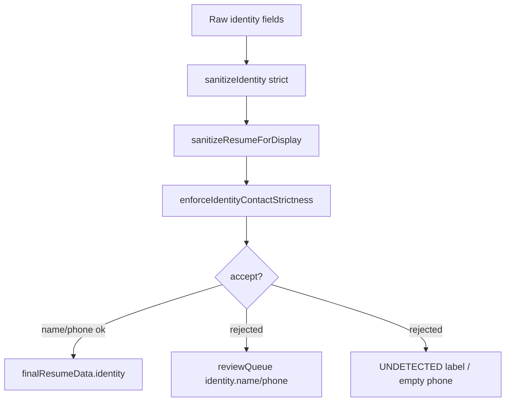

# IDENTITY_CONTACT_STRICTNESS_REPORT

**Status:** PASS
**Policy:** `IDENTITY_CONTACT_STRICTNESS_V1`
**Generated:** 2026-06-12T10:54:43.956Z
**Checks:** 29/29

## Problem

OCR and heuristic parsers sometimes promote employer/client lines to `identity.name`, or fabricate/merge phone numbers with years, page footers, or extra digits. Wrong contact data is worse than empty fields.

## Rules enforced

| Rule | Behavior |
|------|----------|
| Never use company name as person name | `looksLikeCompanyOrAgencyName`, employer collision, client dictionary |
| Never invent phone digits | Strict regex + digit equality check in `normalizeContactPhone` |
| Never merge phone with years/page numbers | `phoneHasYearOrDatePollution` (+ Page N of M, N/M footer) |
| Low confidence → reviewQueue | `buildNameReviewItem` / `buildPhoneReviewItem` → semantic gate |
| Missing name better than wrong name | Strip → `Information non détectée` |
| Missing phone better than fake phone | Strip → empty + review item |

## Thresholds

| Field | Min confidence |
|-------|---------------:|
| Name | 80 |
| Phone | 85 |

## Code modules

| Module | Role |
|--------|------|
| `identity-contact-strictness.js` | Central policy: assess + enforce + review items |
| `identity-extraction.js` | Header-only name candidates, company patterns |
| `phone-normalize.js` | Strict extraction, year/page pollution, no digit invention |
| `sanitize-resume-display.js` | Final display gate via `enforceIdentityContactStrictness` |
| `resume-data.js` | Early `sanitizeIdentity` strict pass |
| `no-fake-data-policy.js` | Audit: `isAcceptableDisplayName/Phone` |

## Pipeline flow



## QA summary

| Metric | Value |
|--------|------:|
| Total checks | 29 |
| Passed | 29 |
| Failed | 0 |

## Regression samples

| Case | Name | Phone |
|------|------|-------|
| Lontac Impressions CV | — | — |
| Invented digits (+336434343830) | — | (empty) |
| Page footer merge | — | (empty) |
| Valid Sophie Martin | Sophie Martin | +33698765432 |

## Checklist

| Check | Status | Detail |
|-------|--------|--------|
| policy_version | PASS | — |
| rules_missing_name_ok | PASS | — |
| rules_missing_phone_ok | PASS | — |
| rules_review_queue | PASS | — |
| reject_company_as_name | PASS | company_like_name |
| company_name_review_item | PASS | — |
| reject_invented_phone_digits | PASS | no_strict_match |
| reject_phone_year_merge | PASS | — |
| phone_year_pollution_detected | PASS | — |
| reject_phone_page_merge | PASS | — |
| phone_page_pollution_detected | PASS | — |
| reject_phone_page_fraction | PASS | — |
| accept_valid_name | PASS | — |
| accept_valid_phone | PASS | — |
| empty_name_not_accepted | PASS | — |
| uncertain_label_not_wrong_name | PASS | — |
| enforce_strips_bad_identity | PASS | name=Information non détectée |
| enforce_emits_name_review | PASS | — |
| enforce_emits_phone_review | PASS | — |
| pipeline_no_company_name | PASS | name=(empty) |
| pipeline_missing_name_ok | PASS | name= |
| pipeline_name_review_or_empty | PASS | — |
| pipeline_no_fake_phone | PASS | phone=(empty) |
| pipeline_phone_review_queue | PASS | — |
| pipeline_no_page_merged_phone | PASS | phone= |
| pipeline_page_phone_review_or_empty | PASS | — |
| pipeline_good_name_kept | PASS | name=Sophie Martin |
| pipeline_good_phone_kept | PASS | phone=+33698765432 |
| render_no_company_in_cvname | PASS | — |

## Verification

```bash
npm run qa:identity-contact-strictness
npm run identity-contact-strictness-report
npm run qa:no-fake-data-policy
npm run qa:identity-false-name
```

## Related

- `IDENTITY_FALSE_NAME_FIX_REPORT.md`
- `NO_FAKE_PASS_IMPORT_GATE_REPORT.md`
- `IDENTITY_SOURCE_PRIORITY_REPORT.md`

## QA log (tail)

```
PASS policy_version
PASS rules_missing_name_ok
PASS rules_missing_phone_ok
PASS rules_review_queue
PASS reject_company_as_name
PASS company_name_review_item
PASS reject_invented_phone_digits
PASS reject_phone_year_merge
PASS phone_year_pollution_detected
PASS reject_phone_page_merge
PASS phone_page_pollution_detected
PASS reject_phone_page_fraction
PASS accept_valid_name
PASS accept_valid_phone
PASS empty_name_not_accepted
PASS uncertain_label_not_wrong_name
PASS enforce_strips_bad_identity
PASS enforce_emits_name_review
PASS enforce_emits_phone_review
NODE_RESUMEDATA_COUNTS {
  path: 'buildResumeData:importResult',
  experiences: 2,
  education: 0,
  skills: 2,
  tools: 1,
  languages: 0,
  clients: 0,
  projects: 0,
  unsorted: 1
}
PASS pipeline_no_company_name
PASS pipeline_missing_name_ok
PASS pipeline_name_review_or_empty
NODE_RESUMEDATA_COUNTS {
  path: 'buildResumeData:importResult',
  experiences: 3,
  education: 0,
  skills: 0,
  tools: 0,
  languages: 0,
  clients: 0,
  projects: 0,
  unsorted: 2
}
PASS pipeline_no_fake_phone
PASS pipeline_phone_review_queue
NODE_RESUMEDATA_COUNTS {
  path: 'buildResumeData:importResult',
  experiences: 3,
  education: 0,
  skills: 0,
  tools: 0,
  languages: 0,
  clients: 0,
  projects: 0,
  unsorted: 1
}
PASS pipeline_no_page_merged_phone
PASS pipeline_page_phone_review_or_empty
NODE_RESUMEDATA_COUNTS {
  path: 'buildResumeData:importResult',
  experiences: 3,
  education: 0,
  skills: 1,
  tools: 0,
  languages: 0,
  clients: 0,
  projects: 0,
  unsorted: 0
}
PASS pipeline_good_name_kept
PASS pipeline_good_phone_kept
CV_TEMPLATE_BOOT_OK
PASS render_no_company_in_cvname

═══ Identity Contact Strictness: 29/29 PASS ═══

(node:68937) [MODULE_TYPELESS_PACKAGE_JSON] Warning: Module type of file:///Users/yohannazancot/YOAZ_STUDIO_OS/hirely_FINAL_CURSOR_STABLE_UI/src/core/validation/identity-contact-strictness.js is not specified and it doesn't parse as CommonJS.
Reparsing as ES module because module syntax was detected. This incurs a performance overhead.
To eliminate this warning, add "type": "module" to /Users/yohannazancot/YOAZ_STUDIO_OS/hirely_FINAL_CURSOR_STABLE_UI/package.json.
(Use `node --trace-warnings ...` to show where the warning was created)
```
