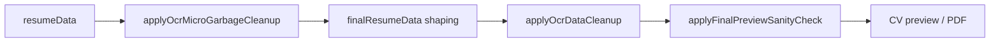

# OCR Data Cleanup Report (P0)

**Status:** PASS
**Policy:** `OCR_DATA_CLEANUP_V1`
**Generated:** 2026-06-13T23:50:30.788Z

## Goal

Clean final CV before rendering. OCR junk, parser labels, i18n keys, and partial languages never reach preview; skills and software are routed without duplication.

## Acceptance

| Criterion | Status |
| --- | --- |
| No "Native am" | **PASS** |
| No "extractionQuality_emailOk" | **PASS** |
| No garbage fragments | **PASS** |
| No duplicated labels | **PASS** |
| Skills/tools routed | **PASS** |

## Removed from preview

| Category | Examples | Enforcement |
| --- | --- | --- |
| Isolated fragments | `am`, `co`, `n`, `20` | `isMicroGarbageOnlyLine` |
| Raw section labels | `Skills`, `Education`, `Experience` | `isSectionLabelLeakage` |
| Duplicated labels | `Skills` twice in list | per-field dedupe |
| Page numbers | `Page 1`, `1 / 2` | `isPageNumberLine` |
| OCR junk | trailing `@`, `:` | `stripMicroGarbageFromText` |
| Partial language lines | `Native am` | `sanitizeLanguageLine` |
| camelCase i18n keys | `extractionQuality_emailOk` | `isCamelCaseI18nKey` |

## Languages

Only normalized lines such as `French — native`, `English — fluent`, `Spanish — intermediate`. Polluted or partial lines → reviewQueue.

## Skills / tools

| Rule | Behavior |
| --- | --- |
| Creative skills | Stay in `skills` |
| Software / tools | Routed to `tools` via `partitionSkillsAndTools` |
| No duplication | Same token never in both arrays |

## Pipeline placement



## Modules

| Module | Role |
| --- | --- |
| `ocr-data-cleanup.js` | Unified final cleanup + skills/tools partition |
| `ocr-micro-garbage-cleanup.js` | Language/contact micro-fragments |
| `section-label-leakage-guard.js` | Parser section headers |
| `final-preview-sanity-check.js` | Invokes `applyOcrDataCleanup` before render |

## QA suites

| Suite | Result |
| --- | --- |
| `qa-ocr-data-cleanup` | PASS |
| `qa-ocr-micro-garbage-cleanup` | PASS |
| `qa-final-preview-sanity-check` | PASS |

**Unit checks:** 25/25

## Unit checks

| Check | Status |
| --- | --- |
| policy_version | PASS |
| reject_native_am | PASS |
| reject_i18n_key | PASS |
| reject_page_number | PASS |
| reject_section_label | PASS |
| reject_fragment_co | PASS |
| accept_french_native | PASS |
| accept_english_fluent | PASS |
| accept_spanish_intermediate | PASS |
| routes_software_to_tools | PASS |
| keeps_skills | PASS |
| no_skills_tools_dup | PASS |
| strips_i18n_from_skills | PASS |
| strips_parser_labels | PASS |
| dedupes_skills | PASS |
| routes_photoshop | PASS |
| no_native_am | PASS |
| cleanup_audit_pass | PASS |
| pipeline_no_native_am | PASS |
| pipeline_no_i18n_key | PASS |
| pipeline_no_page_number | PASS |
| pipeline_no_skills_label | PASS |
| pipeline_photoshop_in_tools | PASS |
| pipeline_valid_languages | PASS |
| preview_sanity_audit | PASS |

## Samples

| Field | Value |
| --- | --- |
| Languages | French — native, English — fluent |
| Skills | Graphic Design, Brand Identity, Typography, Branding |
| Tools | Photoshop, Figma |
| Review items | 3 |

## Verify

```bash
npm run qa:ocr-data-cleanup
npm run ocr-data-cleanup-report
npm run qa:ocr-micro-garbage-cleanup
npm run qa:final-preview-sanity-check
```
