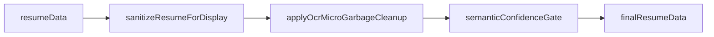

# OCR_MICRO_GARBAGE_CLEANUP_REPORT

**Status:** PASS
**Policy:** `OCR_MICRO_GARBAGE_CLEANUP_V1`
**Generated:** 2026-06-12T14:36:27.824Z
**Checks:** 26/26

## Problem

OCR extraction still injects micro-fragments into CV preview: polluted language lines (`Native am`), isolated tokens (`am`, `co`, `20`), and trailing contact junk (`@`, `:`).

## Rules enforced

| Rule | Behavior |
|------|----------|
| Language fragments < 4 chars | Rejected unless exact language name (French, English, …) |
| Known language patterns only | `French native`, `English fluent`, `Spanish intermediate`, … |
| Trailing OCR junk | Strip/remove `am`, `co`, `20`, `n`, `m`, `@`, `:` |
| No partial words on CV | Micro-garbage never kept in preview sections |
| Low confidence → reviewQueue | `buildMicroGarbageReviewItem` before `finalResumeData` |

## Pipeline placement



## Module

| File | Role |
|------|------|
| `ocr-micro-garbage-cleanup.js` | Strip/gate languages, skills, identity, unsorted |
| `final-resume-contract.js` | Runs cleanup before semantic gate |
| `final-cv-readability.js` | Language polish uses `sanitizeLanguageLine` |

## QA summary

| Metric | Value |
|--------|------:|
| Total | 26 |
| Passed | 26 |
| Failed | 0 |

## Samples

| Field | Value |
|-------|-------|
| Final languages | French — native, English — fluent |
| Review items | 1 |

## Checklist

| Check | Status | Detail |
|-------|--------|--------|
| policy_version | PASS | — |
| reject_token_am | PASS | — |
| reject_token_co | PASS | — |
| reject_token_n | PASS | — |
| reject_token_m | PASS | — |
| reject_token_20 | PASS | — |
| reject_token_@ | PASS | — |
| reject_token_: | PASS | — |
| reject_native_am | PASS | — |
| reject_short_am | PASS | — |
| accept_french_native | PASS | — |
| accept_english_fluent | PASS | — |
| accept_spanish_intermediate | PASS | — |
| accept_french_dash_native | PASS | — |
| strip_trailing_am | PASS | — |
| strip_trailing_at | PASS | — |
| cleanup_strips_polluted_language | PASS | — |
| cleanup_keeps_valid_languages | PASS | — |
| cleanup_language_review | PASS | — |
| cleanup_no_am_in_skills | PASS | — |
| cleanup_strips_contact_fragment | PASS | — |
| pipeline_no_native_am | PASS | — |
| pipeline_no_bare_am | PASS | — |
| pipeline_has_valid_language | PASS | — |
| pipeline_review_or_strip | PASS | — |
| strip_partial_word | PASS | — |

## Verification

```bash
npm run qa:ocr-micro-garbage-cleanup
npm run ocr-micro-garbage-cleanup-report
npm run check:exports
npm run check:core
```
