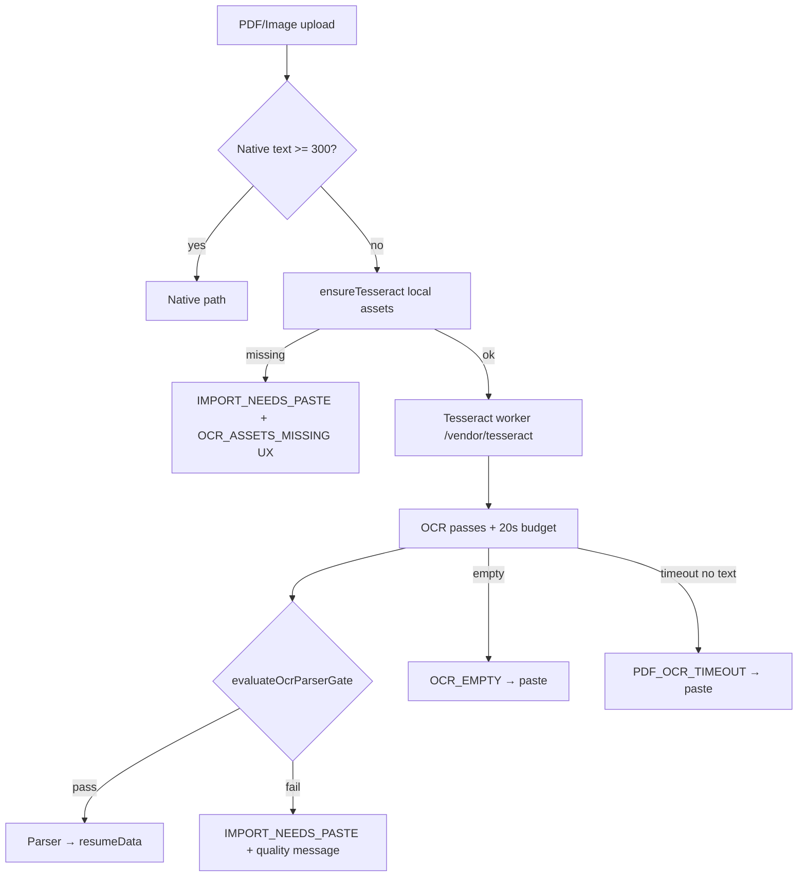

# OCR_RELIABILITY_AUDIT_REPORT

**Status:** PASS
**Audit:** `OCR_RELIABILITY_AUDIT_V1`
**Generated:** 2026-06-12T10:53:27.361Z
**Checks:** 42/42
**Browser CSP QA:** PASS

## Scope

Browser-local Tesseract OCR for scanned PDFs and images — asset hosting, CSP, timeouts, empty-text honesty, quality gating, and paste fallback when OCR cannot run.

## Checklist summary

| # | Requirement | Result |
|---|-------------|--------|
| 1 | Local Tesseract assets exist | PASS |
| 2 | No CDN dependency at runtime | PASS |
| 3 | Worker loads locally | PASS |
| 4 | CSP allows worker-src correctly | PASS |
| 5 | OCR timeout is realistic | PASS |
| 6 | OCR does not pretend success on empty text | PASS |
| 7 | OCR result is scored before use | PASS |
| 8 | OCR cannot run → IMPORT_NEEDS_PASTE + clear UX | PASS |

## Thresholds

| Constant | Value |
|----------|------:|
| `PDF_EXTRACTION_MAX_MS` | 20000 |
| `OCR_ABSOLUTE_MAX_MS` | 20000 |
| `OCR_UI_SOFT_TIMEOUT_MS` | 8000 |
| `OCR_QUALITY_MIN_PASS` | 42 |

## 1. Local Tesseract assets exist

Six vendored files under `/vendor/tesseract/` (main, worker, 2× WASM core, eng+fra traineddata). Setup: `npm run setup:vendor-tesseract` (one-time download; not a runtime CDN).

| Check | Status | Detail |
|-------|--------|--------|
| local_tesseract_assets | PASS | all present |
| asset_tesseract.min.js | PASS | 66695b |
| asset_worker.min.js | PASS | 123724b |
| asset_tesseract-core-simd-lstm.wasm.js | PASS | 3938657b |
| asset_tesseract-core-lstm.wasm.js | PASS | 3938277b |
| asset_eng.traineddata.gz | PASS | 2952873b |
| asset_fra.traineddata.gz | PASS | 707406b |

## 2. No CDN dependency at runtime

Production code loads `/vendor/tesseract/*` only. `getLocalTesseractOptions()` sets `workerPath`, `corePath`, `langPath`. Build script may fetch from jsdelivr once; archived `legacy-public` CDN path is not used.

| Check | Status | Detail |
|-------|--------|--------|
| no_cdn_runtime_import | PASS | clean |
| worker_path_local | PASS | — |
| core_path_local | PASS | — |
| lang_path_local | PASS | — |
| worker_blob_url_disabled | PASS | — |

## 3. Worker loads locally

`csp-safe-loader.js` → `ensureTesseract()` → same-origin script + `workerBlobURL: false` so workers spawn from `/vendor/tesseract/worker.min.js`.

| Check | Status | Detail |
|-------|--------|--------|
| worker_blob_url_disabled | PASS | — |
| csp_loader_uses_vendor_tesseract | PASS | — |
| ocr_tesseract_uses_getLocalTesseractOptions | PASS | — |

## 4. CSP allows worker-src correctly

`index.html` meta CSP: `worker-src 'self' blob:` + `wasm-unsafe-eval` for WASM OCR core (no broad `unsafe-eval`).

| Check | Status | Detail |
|-------|--------|--------|
| csp_worker_src_self | PASS | default-src 'self'; script-src 'self' 'unsafe-inline' blob: 'wasm-unsafe-eval'; style-src 'self' 'unsafe-inline' https:/ |
| csp_worker_src_blob | PASS | — |
| csp_wasm_unsafe_eval | PASS | — |
| csp_no_unsafe_eval | PASS | — |

## 5. OCR timeout is realistic

Hard budget **20s** (`PDF_EXTRACTION_MAX_MS`). UI soft hint at **8s**; rotation trials capped at **8s**. Partial text recovery allowed; empty extract → paste fallback.

| Check | Status | Detail |
|-------|--------|--------|
| pdf_extraction_max_20s | PASS | 20000 |
| ocr_absolute_matches_budget | PASS | — |
| early_paste_before_hard_cap | PASS | — |
| early_paste_8s | PASS | — |
| rotation_trial_cap_8s | PASS | — |

## 6. OCR does not pretend success on empty text

`runCachedTimedPdfOcr` throws `OCR_EMPTY` when `hasValidOcrResult` is false. `OCR_RESULT_DISCARDED empty_text` logged. Parser not invoked on empty OCR.

| Check | Status | Detail |
|-------|--------|--------|
| throws_ocr_empty | PASS | — |
| has_valid_ocr_result_guard | PASS | — |
| discards_empty_result | PASS | — |
| empty_text_fails_quality_gate | PASS | score=0 |

## 7. OCR result is scored before use

`evaluateOcrParserGate()` in `pdf-ocr-run.js` before return; `ocr-parser-gate.js` blocks parser in `canonical-import.js`. Min score **42** + CV anchors (email/phone/years/keywords).

| Check | Status | Detail |
|-------|--------|--------|
| pdf_ocr_run_evaluates_gate | PASS | — |
| ocr_parser_gate_blocks_parser | PASS | — |
| quality_min_pass_42 | PASS | — |
| gibberish_rejected | PASS | — |
| good_sample_passes_gate | PASS | — |

## 8. OCR cannot run → IMPORT_NEEDS_PASTE + clear UX

`OcrUnavailableError` (`OCR_ASSETS_MISSING`, `OCR_SCRIPT_LOAD_FAILED`) + timeout/quality → `IMPORT_NEEDS_PASTE`. User copy in `import-fallback-ux.js` (scanned/illisible, OCR local indisponible, timeout).

| Check | Status | Detail |
|-------|--------|--------|
| fallback_ocr_assets_missing | PASS | — |
| fallback_ocr_script_failed | PASS | — |
| fallback_ocr_unavailable | PASS | — |
| fallback_ocr_quality_copy | PASS | — |
| extract_timeout_needs_paste | PASS | — |
| ocr_unavailable_error_class | PASS | — |
| verify_assets_before_load | PASS | — |

## Architecture



## Vendored assets

- `/vendor/tesseract/tesseract.min.js` — 66695 bytes
- `/vendor/tesseract/worker.min.js` — 123724 bytes
- `/vendor/tesseract/core/tesseract-core-simd-lstm.wasm.js` — 3938657 bytes
- `/vendor/tesseract/core/tesseract-core-lstm.wasm.js` — 3938277 bytes
- `/vendor/tesseract/lang/eng.traineddata.gz` — 2952873 bytes
- `/vendor/tesseract/lang/fra.traineddata.gz` — 707406 bytes

## Known gaps / watch

| Item | Severity | Notes |
|------|----------|-------|
| `qualityBypass` after timeout | low | Very short partial OCR (&lt;20 chars) may skip gate on absolute fallback — still blocked by 300-char import gate |
| `setup-vendor-tesseract.mjs` uses jsdelivr | info | Build-time only; not loaded in browser |
| Vendored `worker.min.js` contains jsdelivr fallback string | info | Overridden at runtime via `getLocalTesseractOptions()` |
| `multiFormat.nativeTextLength` in browser QA | info | Sometimes 0 in reports; selected text length is authoritative |

## Verification

```bash
npm run setup:vendor-tesseract
npm run qa:ocr-reliability-audit
npm run local-ocr-csp-fix-report   # browser: 0 jsdelivr requests
npm run ocr-reliability-audit-report
npm run qa:ocr-quality-score
npm run qa:ocr-parser-gate
```

## Related

- `LOCAL_OCR_CSP_FIX_REPORT.md`
- `REAL_CV_IMPORT_ROOT_FIX_REPORT.md`
- `NO_FAKE_PASS_IMPORT_GATE_REPORT.md`
