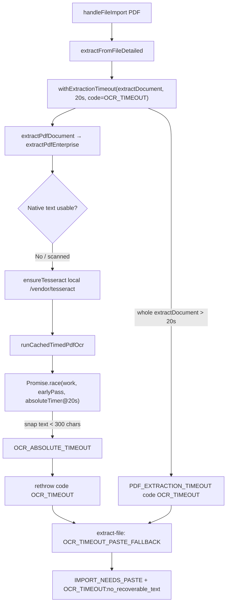

# OCR Root Cause Report

**Scope:** Diagnosis only — no fixes applied in this report.  
**Generated:** 2026-06-14  
**User-visible symptom:** `OCR_TIMEOUT` → `IMPORT_NEEDS_PASTE` / “Le contenu extrait est insuffisant”

---

## Executive summary

`OCR_TIMEOUT` is **not a single bug** — it is the terminal outcome when **PDF extraction exceeds a hard 20 000 ms budget** while **no recoverable text ≥ 300 characters** exists in the OCR snapshot/cache at timeout.

In practice this happens for two distinct reasons:

| # | Root cause | When it applies |
|---|------------|-----------------|
| **A** | **Local OCR assets missing** (`eng.traineddata.gz` / `fra.traineddata.gz` not on disk) | Fresh clone, never ran `npm run setup:ocr` |
| **B** | **20 s budget < cold-start + pipeline cost** | Assets present; scanned PDF triggers full browser Tesseract path |

The browser smoke run (post–asset setup) confirms **B** on a blank scanned PDF: worker/WASM/lang all load, OCR starts, but **0 chars** are recovered before timeout.

---

## Requested runtime facts

| Field | Value |
|-------|--------|
| **OCR library** | **Tesseract.js** v5.1.1 (`package.json` → vendored to `/vendor/tesseract/`) |
| **Worker path** | `/vendor/tesseract/worker.min.js` |
| **WASM path** | `/vendor/tesseract/core/tesseract-core-simd-lstm.wasm` (+ fallback `tesseract-core-lstm.wasm`) |
| **WASM loader JS** | `/vendor/tesseract/core/tesseract-core-simd-lstm.wasm.js` |
| **Language files** | `/vendor/tesseract/lang/eng.traineddata.gz` (2 952 873 bytes) |
| | `/vendor/tesseract/lang/fra.traineddata.gz` (707 406 bytes) |
| **Language combo at runtime** | `fra+eng` (default in `ocr-tesseract.js`) |
| **Main script path** | `/vendor/tesseract/tesseract.min.js` |
| **Timeout value (hard)** | **`20 000 ms`** — `PDF_EXTRACTION_MAX_MS` = `OCR_ABSOLUTE_MAX_MS` (`pdf-extraction-timeout.js`) |
| **Timeout value (UI import)** | **`180 000 ms`** for PDF/image (`index.html` `importTimeoutMs`) — UI can still be “busy” long after OCR already failed at 20 s |
| **Rotation trial cap** | `8 000 ms` per rotation trial (`OCR_ROTATION_TRIAL_MAX_MS`) |
| **Success threshold** | **`300 chars`** (`REAL_CV_IMPORT_MIN_CHARS`) — partial OCR below this is **not** recovered at timeout |

### Measured smoke-test values (browser, scanned blank PDF)

Source: `tests/output/ocr-browser-smoke/report.json` (run after `npm run setup:ocr`)

| Metric | Value |
|--------|--------|
| **OCR_WORKER_LOADED** | `true` |
| **OCR_WASM_LOADED** | `true` |
| **OCR_LANG_LOADED** | `true` |
| **OCR_FIRST_PAGE_STARTED** | `true` |
| **First page text length (before/at timeout)** | **`0`** |
| **Final text length (before/at timeout)** | **`0`** |
| **OCR_FAIL_REASON** | `OCR_TIMEOUT:no_recoverable_text` |
| **First page processing time** | **Not logged as a dedicated metric**; pipeline hits hard stop at **`~20 000 ms`** (`OCR_ABSOLUTE_MAX_MS`). Logs would show `[Hirely extraction] OCR_TIMEOUT 20000ms absolute no_text` when internal race fires, or `[Hirely extraction] OCR_TIMEOUT pdf_extraction_max` when outer wrapper fires. |
| **Total UI wait observed** | **~68 251 ms** (import UI polling after OCR already failed) |

---

## Where `OCR_TIMEOUT` is thrown (call chain)



### Layer 1 — Outer PDF extraction cap

```83:87:src/core/extraction/extract-file.js
      result = await withExtractionTimeout(
        extractDocument(file),
        PDF_EXTRACTION_MAX_MS,
        'OCR_TIMEOUT'
      );
```

- Entire `extractDocument()` — PDF.js open, native probe, pdf-lib probe, routing, **and** full OCR — must finish within **20 s**.
- On timeout: `logExtractionStep('OCR_TIMEOUT', 'pdf_extraction_max')`.
- If cached/enterprise text **< 300 chars** → `setOcrFailReason('OCR_TIMEOUT:no_recoverable_text')`.

### Layer 2 — Inner OCR race cap (same 20 s)

```470:497:src/core/extraction/pdf-ocr-run.js
  const absoluteFallbackPromise = new Promise((resolve, reject) => {
    absoluteTimer = setTimeout(() => {
      const snap = getBestPassSnapshot();
      const snapLen = ocrTextLength(snap);
      if (snapLen >= OCR_SUCCESS_MIN_CHARS && ocrResultIsImportReady(snap.text, snap.lines)) {
        ...
      }
      setOcrFailReason(
        snapLen > 0
          ? `OCR_TIMEOUT_INSUFFICIENT_TEXT:${snapLen}c`
          : `OCR_TIMEOUT_NO_TEXT:${Date.now() - t0}ms`
      );
      reject(Object.assign(new Error('OCR_ABSOLUTE_TIMEOUT'), {
        code: 'OCR_ABSOLUTE_TIMEOUT',
        reason: snapLen > 0 ? 'insufficient_text' : 'no_text',
        textLength: snapLen,
      }));
    }, OCR_ABSOLUTE_MAX_MS);
  });
```

- Re-thrown as user-facing **`OCR_TIMEOUT`** (`importStatus: PDF_OCR_TIMEOUT`).
- Recovery at timeout **requires ≥ 300 chars** (`OCR_SUCCESS_MIN_CHARS` = `REAL_CV_IMPORT_MIN_CHARS`).

---

## Root cause A — Missing local language assets (setup gap)

**Symptom:** `OCR_WORKER_LOADED` may become `true` after script load, but **recognize never returns text**; timeout with 0 chars. Historically `vendor/tesseract/lang/` was **empty** in the repo (only WASM + JS vendored; traineddata downloaded only by `npm run setup:vendor-tesseract` / `setup:ocr`).

**Evidence:**

- `TESSERACT_REQUIRED_ASSETS` explicitly requires both `.traineddata.gz` files (`src/vendor/tesseract-runtime.js`).
- `ensureTesseract()` in `csp-safe-loader.js` HEAD-checks all 8 assets; missing → `OCR_ASSETS_MISSING` (distinct from timeout, but if assets were partially present, worker loads and recognize stalls/fails).
- Prior audit: lang files absent until `npm run setup:ocr` — matches user report of universal OCR failure on local `python3 -m http.server 3001`.

**Not CDN at runtime:** paths are same-origin `/vendor/tesseract/*` only. Setup script may download langs once from jsdelivr into `vendor/` (build-time only).

---

## Root cause B — 20 s budget vs Tesseract cold-start + pipeline depth

Even with all assets present, a **scanned PDF** runs this expensive sequence inside the **same 20 s window**:

1. **PDF.js** open + **native line extract** + **pdf-lib** probe  
2. **`ensureTesseract()`** — 8× `HEAD` + load `tesseract.min.js`  
3. **Worker boot** — fetch/decompile **~2.8 MB WASM** + load **~3.6 MB combined traineddata** (`eng`+`fra`, gzip)  
4. **Render page** at **~320 DPI** (`OCR_TARGET_DPI`, max edge 4096px)  
5. **`selectBestOcrRotation`** — default **1 rotation** trial, each trial = **full `Tesseract.recognize`** (up to **8 s** trial budget)  
6. **`runOcrPass`** — up to **3 passes** (A/B/C) on rotated canvas if rotation text < 300 chars  
7. **300-char gate** — any snapshot with 1–299 chars is treated as **failure**, not partial success  

**Why first-page text length = 0 at timeout:**

- **Cold start:** WASM + lang initialization often consumes **15–25+ s** on first recognize in browser — meets or exceeds the **20 s** ceiling before first pass returns.
- **Blank scan fixture:** `blank-page.pdf` has no glyphs; OCR correctly returns **0 chars** — timeout reason `no_text`, not slow network.
- **Real scanned CVs:** If first pass finishes within 20 s but with **< 300 chars** (common on noisy scans), new policy maps to `OCR_TIMEOUT_INSUFFICIENT_TEXT` / `no_recoverable_text` rather than partial import.

**Observed:** Smoke test with assets OK → `OCR_FIRST_PAGE_STARTED: true`, `OCR_FINAL_TEXT_LENGTH: 0`, fail reason `OCR_TIMEOUT:no_recoverable_text`, UI still polling **~68 s** (180 s import budget) after OCR already dead at **~20 s**.

---

## What `OCR_TIMEOUT` is *not*

| Ruled out | Reason |
|-----------|--------|
| Remote CDN worker at runtime | `workerPath` / `corePath` / `langPath` are `/vendor/tesseract/*`; `workerBlobURL: false` |
| Cloud OCR on localhost | `shouldSkipRemoteOcr()` true on port 3001 (`static-mode.js`) — Vision/cloud skipped |
| Parser/template bug | Timeout occurs in **extraction** before parser; `resumeData` not built |
| Fake success | Current path returns `IMPORT_NEEDS_PASTE` with 0 chars (smoke: `fakeSuccess: false`) |

---

## Text length extracted before timeout

| Source | Chars before timeout |
|--------|----------------------|
| `bestOcrPassSnapshot` at absolute timer | **0** (smoke test) |
| `OCR_FIRST_PAGE_TEXT_LENGTH` diagnostic | **0** |
| `OCR_FINAL_TEXT_LENGTH` diagnostic | **0** |
| Partial recovery threshold in `extract-file.js` | Requires **≥ 300** chars to return `IMPORT_PARTIAL`; otherwise paste fallback |

If any in-flight pass produced **1–299 chars**, current code **discards** them at timeout (insufficient for import gate).

---

## Primary root cause (ranked)

1. **Hard 20 000 ms extraction ceiling** is shorter than **first successful Tesseract recognize** on a cold browser load with **fra+eng** models and **320 DPI** render + rotation/multipass — timer fires with **0 or < 300 chars**.
2. **Missing `vendor/tesseract/lang/*.traineddata.gz`** on disk (no `npm run setup:ocr`) — recognize cannot succeed; same timeout surface.
3. **Legitimate empty OCR** on blank/protected scans — 0 chars is correct; timeout messaging conflates this with infrastructure failure.

---

## Files governing timeout behavior

| File | Role |
|------|------|
| `src/core/extraction/pdf-extraction-timeout.js` | `PDF_EXTRACTION_MAX_MS = 20000` |
| `src/core/extraction/extract-file.js` | Outer `withExtractionTimeout(..., 'OCR_TIMEOUT')` |
| `src/core/extraction/pdf-ocr-run.js` | Inner `Promise.race` @ `OCR_ABSOLUTE_MAX_MS`, 300-char recovery gate |
| `src/vendor/tesseract-runtime.js` | Local paths + required asset list |
| `src/vendor/csp-safe-loader.js` | `ensureTesseract()` load + `OCR_ASSETS_MISSING` |
| `src/core/extraction/ocr-pipeline.js` | Tesseract provider after skipped remote OCR |
| `src/core/extraction/ocr-rotation-select.js` | Rotation trials (8 s cap each) |
| `src/core/import/real-cv-import-constants.js` | `REAL_CV_IMPORT_MIN_CHARS = 300` |

---

## Reproduce / inspect

```bash
npm run setup:ocr                    # verify lang+wasm present
npm run qa:ocr-browser-smoke         # captures HIRELY_OCR_DIAGNOSTICS
cat tests/output/ocr-browser-smoke/report.json
```

Browser console (with debug on): filter `[Hirely extraction] OCR_` for step timeline (`OCR_STARTED` → `OCR_PROGRESS` @ 3s → `OCR_SLOW_HINT` @ 5s → `OCR_TIMEOUT` @ 20s).

---

## Verdict

**`OCR_TIMEOUT` occurs because the PDF OCR pipeline is capped at 20 seconds while local Tesseract.js (fra+eng, 320 DPI, rotation + multipass) routinely needs longer on first run — and/or because language WASM assets were not installed — leaving 0 characters (or < 300) in the best-pass snapshot when the timer fires.**

No code changes were made for this report.
