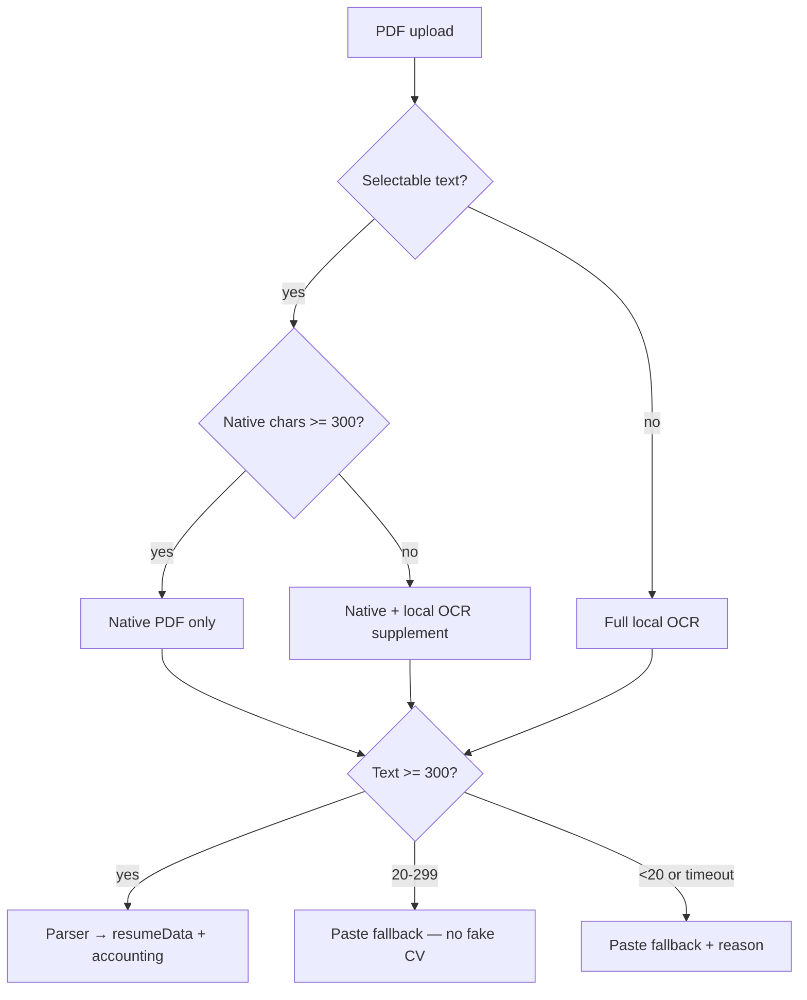

# REAL_CV_IMPORT_ROOT_FIX_REPORT

**Status:** PASS
**Engine:** `REAL_CV_IMPORT_ROOT_V1`
**Generated:** 2026-06-12T10:07:58.397Z
**QA:** 29/29 root-fix checks
**PDF reliability QA:** PASS

## Problem

Real CV uploads often ended in `IMPORT_NEEDS_PASTE`, `OCR_TIMEOUT`, or low `selectedTextLength` — while known/clean fixtures passed. Thin extracts sometimes produced fake empty CV shells instead of honest paste fallback.

## Policy (5 rules)

| # | Rule | Implementation |
|---|------|----------------|
| 1 | Selectable PDF → native text first | `pdf-router.js` keeps `NATIVE` route for text layer |
| 2 | Weak native (&lt;300 chars) → local OCR supplement | `plan.ocrMode: supplement` + `supplementWeakNativeWithOcr` in `enterprise-engine.js` |
| 3 | OCR fail → paste fallback with clear reason | `import-fallback-ux.js` + `buildEmptyExtractPasteResult` / `buildOcrParserBlockedResult` |
| 4 | Extracted text &lt;300 chars → never fake CV | `buildThinTextPasteResult` — `resumeData: null`, raw preserved for paste |
| 5 | Text exists → land in resumeData, reviewQueue, or rejectedGarbage | `ensureImportContentAccounting` after `buildResumeData` |

## Thresholds

- **Meaningful import:** 300 chars (parser / structured CV)
- **Renderable extract:** 20 chars (non-empty extract)

## Extraction routing



## Failure reasons (user-facing)

| Reason | When | UX copy |
|--------|------|---------|
| `thin_text` | 20–299 chars extracted | Texte extrait trop court… |
| `ocr_timeout` | 20s budget exceeded | Lecture automatique trop longue… |
| `ocr_quality` | OCR gate / bad scan | Document scanné ou illisible |
| `weak_native` | Native layer too short, OCR insufficient | Couche texte trop courte… |
| `empty_extract` | No usable text | Lecture incomplète |

## Code changes

| Module | Change |
|--------|--------|
| `src/core/import/real-cv-import-root.js` | Policy constants, thin/empty paste builders, content accounting |
| `src/core/extraction/pdf-router.js` | Weak native → `ocrAllowed` + `supplement` mode |
| `src/core/extraction/enterprise-engine.js` | `supplementWeakNativeWithOcr` + `selectBestTextSource` merge |
| `src/core/import/canonical-import.js` | 300-char gate, paste builders, post-parse accounting |
| `src/core/import/ocr-parser-gate.js` | Preserve raw text + `rejectedGarbage` on OCR block |
| `src/core/import/import-fallback-ux.js` | `thin_text` / `weak_native` / timeout copy |
| `src/core/import/import-status.js` | `IMPORT_SUCCESS` requires 300 chars |
| `src/core/import/import-render-guard.js` | Re-export meaningful/renderable helpers |
| `src/tests/qa-real-cv-import-root-fix.mjs` | Regression suite |

## Verification

```bash
npm run qa:real-cv-import-root-fix
npm run qa:real-pdf-import-reliability
npm run qa:real-world-import-truth
```

## Out of scope (known follow-ups)

- Identity collision when experience rows duplicate person name (`nameCollidesWithEmployers`)
- Browser PDF upload returning 0 raw chars for some production PDFs
- `normalizeResumeData` semantic gates dropping parsed fields
