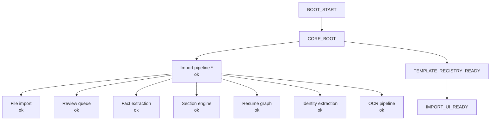

# STARTUP_DEPENDENCY_MAP

Generated: 2026-06-12T19:53:35.062Z

## Startup chain

| Phase | Status | Notes |
|-------|--------|-------|
| BOOT_START | ok | — |
| CORE_BOOT | ok | {"tier":"degraded","degraded":true,"assessment":{"contract":"CORE_BOOT_CONTRACT_V1","importOk":true,"tier":"degraded","f |
| TEMPLATE_REGISTRY_READY | ok | — |
| IMPORT_UI_READY | ok | — |

## Feature tiers (boot contract v1)

| Feature | Required | Module | Load | Missing exports |
|---------|----------|--------|------|-----------------|
| import_core | yes | `src/core/pipeline/hirely-import.js` | loaded | resumeDataMeetsImportMinimum |
| file_import | no | `src/core/import/canonical-import.js` | loaded | — |
| review_queue | no | `src/core/parsing/review-queue.js` | loaded | — |
| fact_extraction | no | `src/core/parsing/fact-pipeline.js` | loaded | extractFactsFromSectionBlocks |
| section_engine | no | `src/core/parsing/section-engine-v2.js` | loaded | — |
| resume_graph | no | `src/core/parsing/resume-graph-engine.js` | loaded | — |
| identity_extraction | no | `src/core/parsing/identity-extraction.js` | loaded | extractIdentityFromText, resolveIdentityContact |
| ocr_pipeline | no | `src/core/extraction/ocr-pipeline.js` | loaded | runOcrPipeline, extractWithOcr |

## Dependency graph

* Required for import — all other features degrade independently.

## Module load matrix

| Module | Status | Error |
|--------|--------|-------|
| `src/core/index.js` | loaded | — |
| `src/core/boot/core-boot-loader.mjs` | loaded | — |
| `src/core/boot/minimal-import-core.mjs` | loaded | — |
| `src/core/pipeline/hirely-import.js` | loaded | — |
| `src/core/import/canonical-import.js` | loaded | — |
| `src/core/parsing/review-queue.js` | loaded | — |
| `src/core/parsing/fact-pipeline.js` | loaded | — |
| `src/core/parsing/section-engine-v2.js` | loaded | — |
| `src/core/parsing/resume-graph-engine.js` | loaded | — |
| `src/core/parsing/identity-extraction.js` | loaded | — |
| `src/core/extraction/ocr-pipeline.js` | loaded | — |

## Browser boot path

1. `index.html` → `getHirelyCore()`
2. Dynamic import `src/core/boot/core-boot-loader.mjs`
3. `loadHirelyCoreForBrowser()` tries `src/core/index.js`
4. On failure → `minimal-import-core.mjs` (paste + file import only)
5. `assessCoreModule()` — fatal only if `import_core` missing
6. `TEMPLATE_REGISTRY_READY` / `IMPORT_UI_READY` — UI markers after core OK
