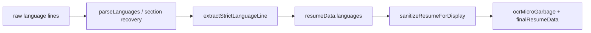

# STRICT_LANGUAGE_EXTRACTION_REPORT

**Status:** PASS
**Policy:** `STRICT_LANGUAGE_EXTRACTION_V1`
**Generated:** 2026-06-12T14:42:40.410Z
**Checks:** 22/22

## Problem

Language sections still showed polluted OCR values (`Native am`, `Fluent analyse`, bare `am`/`co`) instead of structured language + level pairs.

## Rules enforced

| Rule | Behavior |
|------|----------|
| Language name required | French, English, Spanish, … must be present |
| Optional proficiency | `native`, `fluent`, `intermediate`, … after language name |
| Allowed display | `French — native`, `English — fluent`, `Spanish — intermediate` |
| Forbidden OCR junk | `Native am`, `Fluent analyse`, `native co`, `am`, `co` |
| Low confidence → reviewQueue | Never promoted to CV preview |

## Pipeline placement



## Module

| File | Role |
|------|------|
| `strict-language-extraction.js` | Canonical strict parse + review items |
| `rich-parser.js` | `parseLanguages` uses strict extractor |
| `unsorted-section-recovery.js` | Language recovery gated |
| `resume-output-quality.js` | Output polish uses strict batch |
| `sanitize-resume-display.js` | Display drain uses strict extractor |

## QA summary

| Metric | Value |
|--------|------:|
| Total | 22 |
| Passed | 22 |
| Failed | 0 |

## Samples

| Field | Value |
|-------|-------|
| Final languages | French — native, English — fluent |
| Review items | 2 |

## Checklist

| Check | Status | Detail |
|-------|--------|--------|
| policy_version | PASS | — |
| forbid_native_am | PASS | — |
| forbid_fluent_analyse | PASS | — |
| forbid_native_co | PASS | — |
| forbid_am | PASS | — |
| forbid_co | PASS | — |
| reject_native_am_entry | PASS | — |
| reject_fluent_analyse | PASS | — |
| accept_french_native | PASS | — |
| accept_english_fluent | PASS | — |
| accept_spanish_intermediate | PASS | — |
| accept_french_dash_native | PASS | — |
| reject_proficiency_only | PASS | — |
| parse_languages_no_pollution | PASS | — |
| parse_languages_keeps_valid | PASS | — |
| batch_strips_polluted | PASS | — |
| batch_review_items | PASS | — |
| pipeline_no_native_am | PASS | — |
| pipeline_no_fluent_analyse | PASS | — |
| pipeline_no_bare_am | PASS | — |
| pipeline_has_valid | PASS | — |
| pipeline_review_or_strip | PASS | — |

## Verification

```bash
npm run qa:strict-language-extraction
npm run strict-language-extraction-report
npm run qa:ocr-micro-garbage-cleanup
npm run check:core
```
