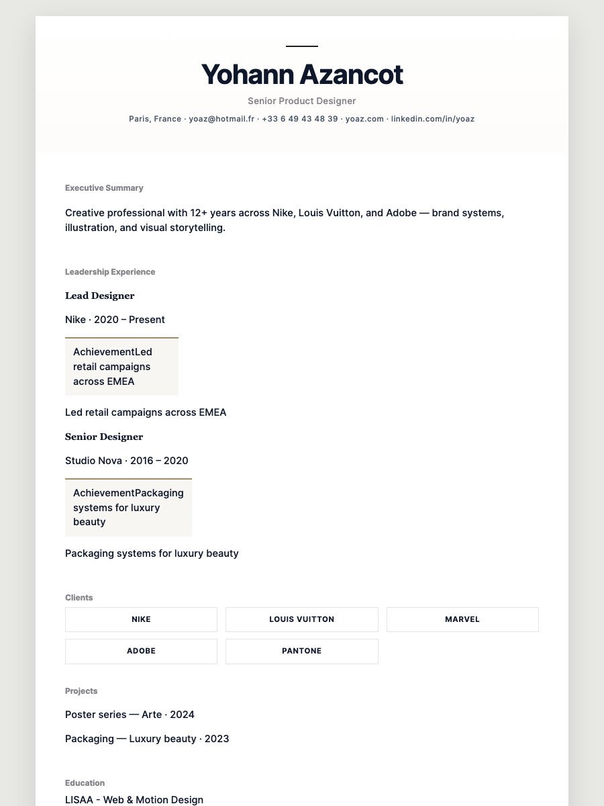
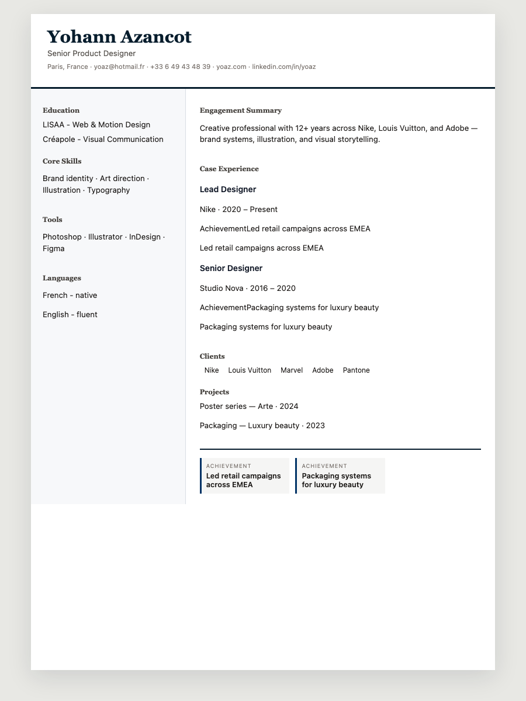
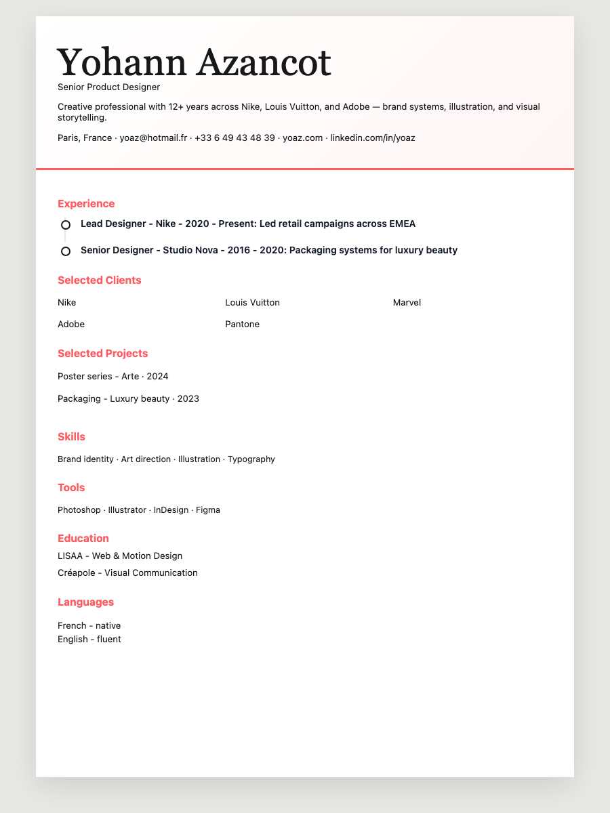
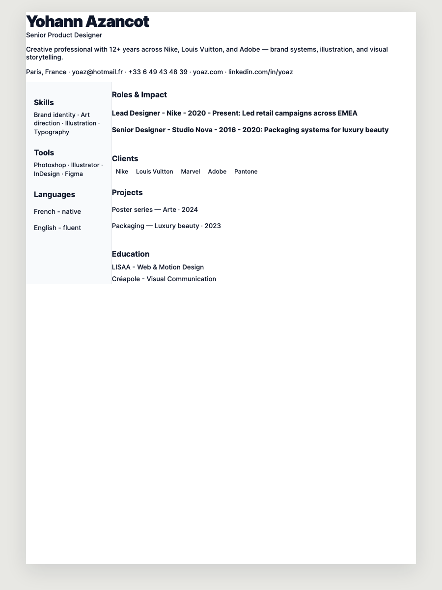
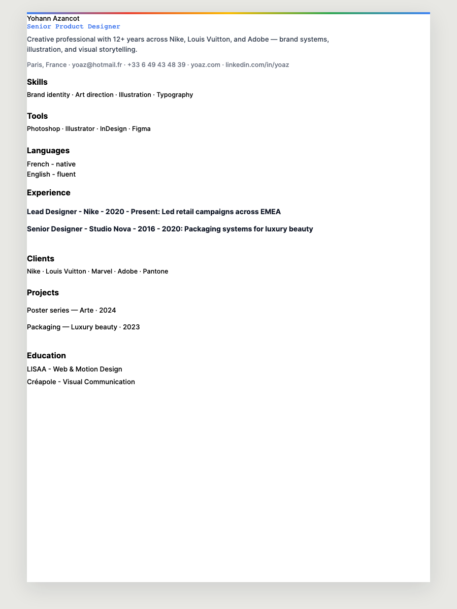
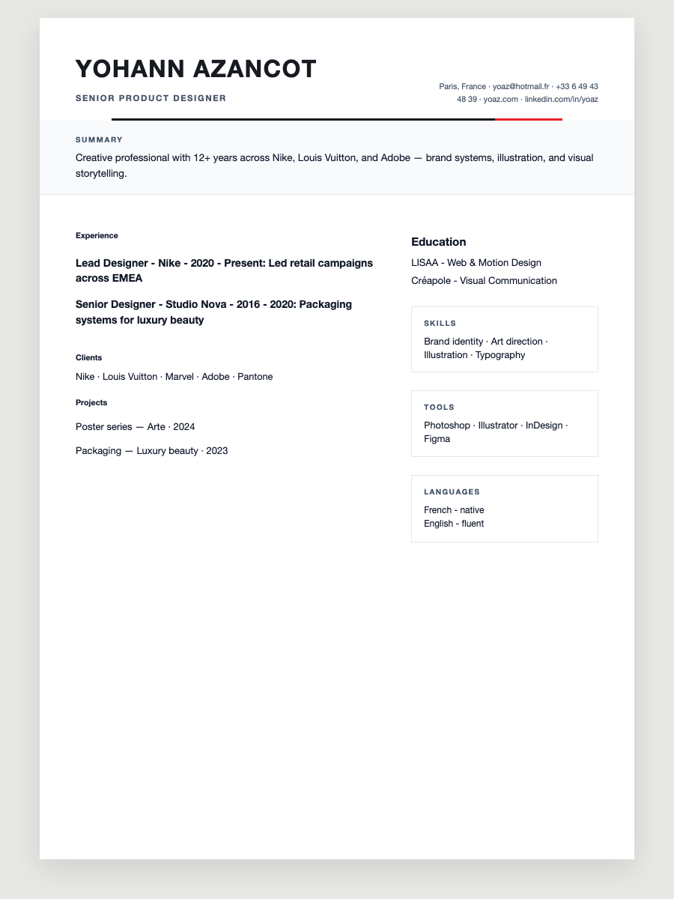
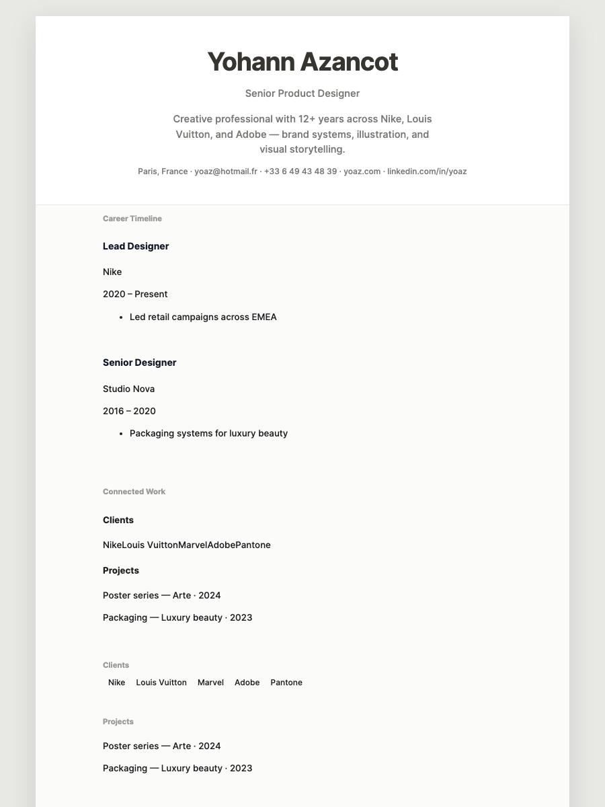
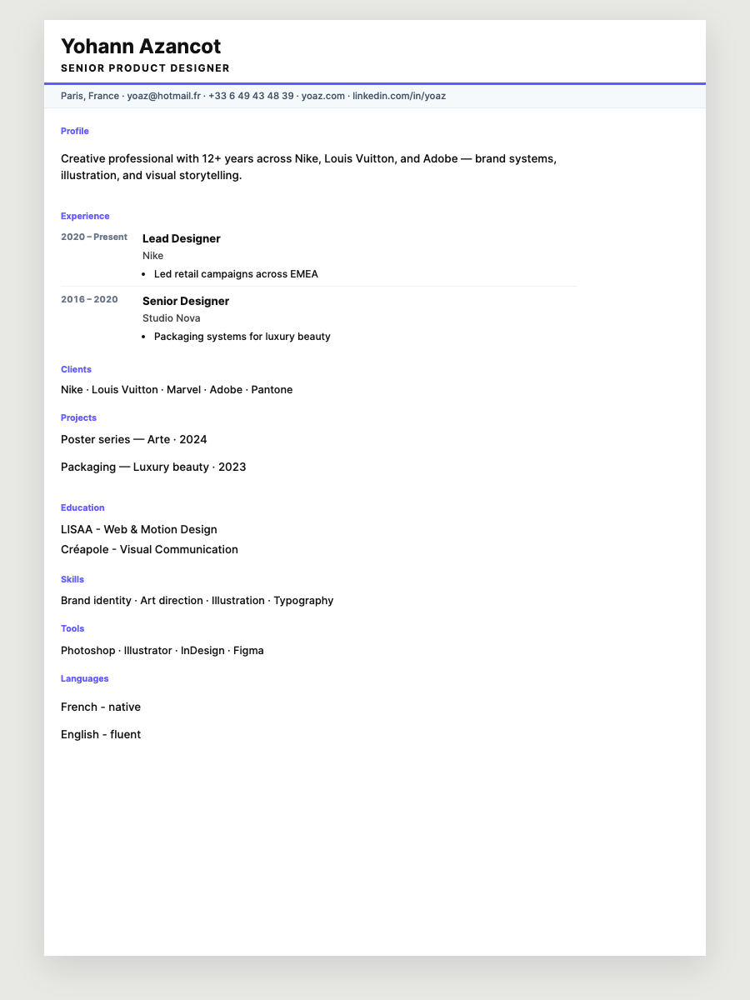

# TEMPLATE_SHOWCASE

**Version:** `TEMPLATE_SHOWCASE_V8`  
**Generated:** 2026-06-14T13:57:12.491Z  
**Templates:** 8 recruiter-grade · ATS-compatible · A4 794×1123px

## Lineup

| # | Template | Inspiration | Layout | ATS |
|---|----------|-------------|--------|-----|
| 01 | 01 Executive | Apple | executive-centered | high |
| 02 | 02 Consulting | McKinsey | consulting-split | high |
| 03 | 03 Creative | Airbnb | portfolio-hero | high |
| 04 | 04 Startup | Linear | founder-split | high |
| 05 | 05 Tech | Google | tech-rail | high |
| 06 | 06 Corporate | Tesla | corporate-split | high |
| 07 | 07 Minimal | Notion | timeline-minimal | high |
| 08 | 08 Premium ATS | Stripe | dense-single | high |

## Design principles

- **ATS compatible** — text skills, semantic sections, no forbidden markup (bars, dots, ribbons)
- **Perfect A4** — 794×1123px preview = PDF export dimensions
- **No overlap** — `break-inside: avoid`, boxed grids, overflow hidden
- **Premium typography** — brand-specific font stacks per template
- **Professional spacing** — tuned vertical rhythm per family
- **Export = preview** — print CSS + `print-color-adjust: exact`

## Brand inspiration map

| Brand | Template | Design language |
|-------|----------|-----------------|
| Apple | 01 Executive | Monument identity, hairline rules, keynote restraint |
| McKinsey | 02 Consulting | Navy authority, 4/8 split, impact matrix |
| Airbnb | 03 Creative | Coral warmth, client grid, hospitality polish |
| Linear | 04 Startup | Purple accent, traction metrics, sharp UI |
| Google | 05 Tech | Multi-color bar, skills rail, systems focus |
| Tesla | 06 Corporate | Minimal red accent, uppercase discipline |
| Notion | 07 Minimal | Warm gray document, subtle borders |
| Stripe | 08 Premium ATS | Indigo precision, dense recruiter grid |

## Screenshots

### 01 01 Executive — inspired by Apple



| Spec | Value |
|------|-------|
| Template ID | `luxury-executive` |
| Grid | Centered monument · single narrative column · 44px margins |
| Typography | SF Pro–style Inter · 32pt name · hairline gold rule |
| Spacing | Apple keynote rhythm · 36px section gaps |
| Emphasis | C-suite gravitas · achievement ribbon · serif display |

### 02 02 Consulting — inspired by McKinsey



| Spec | Value |
|------|-------|
| Template ID | `mckinsey-consulting` |
| Grid | 4/8 asymmetric split · impact matrix footer |
| Typography | Libre Baskerville · IBM Plex Sans · McKinsey navy |
| Spacing | Consulting 24px gaps · matrix cells 16px |
| Emphasis | Quantified outcomes · board credibility |

### 03 03 Creative — inspired by Airbnb



| Spec | Value |
|------|-------|
| Template ID | `creative-director-portfolio` |
| Grid | Hero band · 3-col client grid · case studies |
| Typography | Instrument Serif · DM Sans · Airbnb warmth |
| Spacing | Portfolio 32px hero · 18px grid gaps |
| Emphasis | Brand proof · hospitality warmth · coral accent |

### 04 04 Startup — inspired by Linear



| Spec | Value |
|------|-------|
| Template ID | `startup-founder` |
| Grid | Venture hero · traction strip · 22/78 operator split |
| Typography | Inter 800 · Linear purple accent · mono metrics |
| Spacing | Operator 16px body · 24px hero |
| Emphasis | Product velocity · sharp UI rhythm |

### 05 05 Tech — inspired by Google



| Spec | Value |
|------|-------|
| Template ID | `tech-engineer` |
| Grid | 28/72 skills rail · systems experience column |
| Typography | Google Product Sans feel · multi-color bar · Inter body |
| Spacing | Engineering 14px tight · rail compact |
| Emphasis | Stack clarity · systems shipped |

### 06 06 Corporate — inspired by Tesla



| Spec | Value |
|------|-------|
| Template ID | `classic-corporate` |
| Grid | Masthead · 65/35 credentials split · ruled summary |
| Typography | Tesla minimal · uppercase tracked labels · red accent |
| Spacing | Institutional 40px margins · 22px rhythm |
| Emphasis | Precision engineering · corporate discipline |

### 07 07 Minimal — inspired by Notion



| Spec | Value |
|------|-------|
| Template ID | `apple-minimal` |
| Grid | Single column · 52px margins · timeline spine |
| Typography | Notion warm gray · 11pt body · subtle borders |
| Spacing | Editorial whitespace · 40px between sections |
| Emphasis | Clarity · document-first · no decoration |

### 08 08 Premium ATS — inspired by Stripe



| Spec | Value |
|------|-------|
| Template ID | `ats-recruiter` |
| Grid | Single column · 72ch · contact utility band |
| Typography | Stripe indigo accents · Inter · tabular dates |
| Spacing | Dense 10px rhythm · precise grid |
| Emphasis | Parse density · zero overlap · export fidelity |


## Files

| File | Role |
|------|------|
| `src/ui/templates/template-families-v2.mjs` | 8-template catalog + brand metadata |
| `src/ui/templates/cv-templates.js` | Layout render functions |
| `src/ui/templates/cv-templates-v2-families.css` | Base V2 family styles |
| `src/ui/templates/cv-templates-showcase-v8.css` | Brand polish layer |
| `scripts/template-showcase.mjs` | Screenshot + report generator |

## Regenerate

```bash
node scripts/template-showcase.mjs
npm run template:showcase
```
