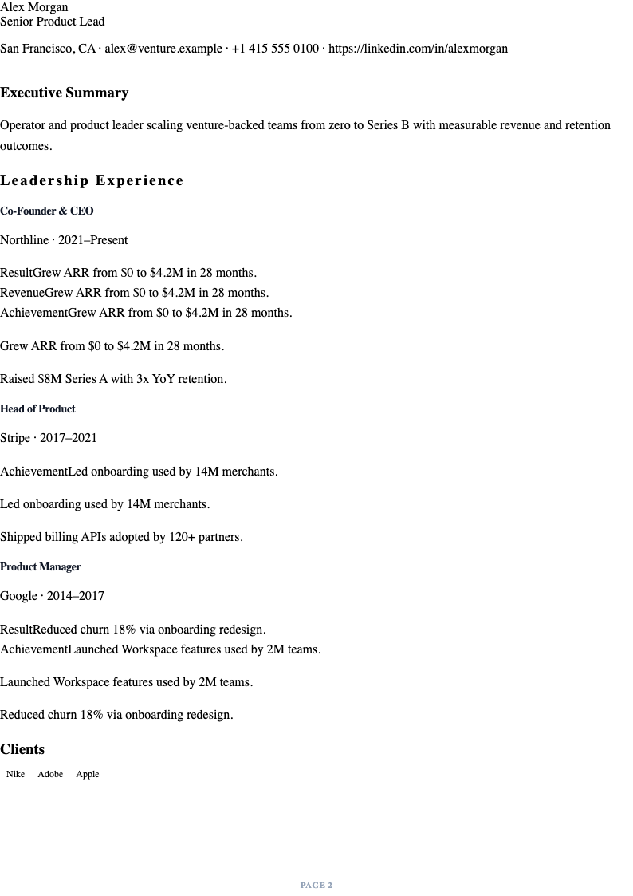
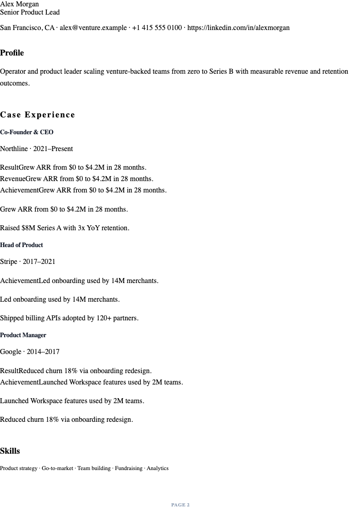
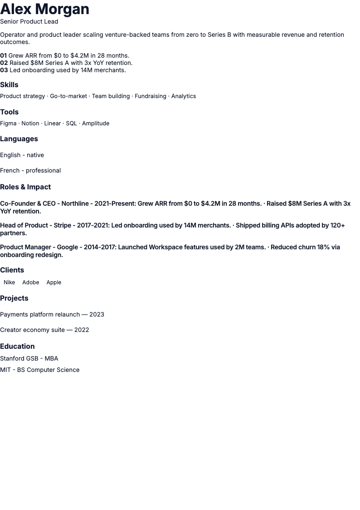
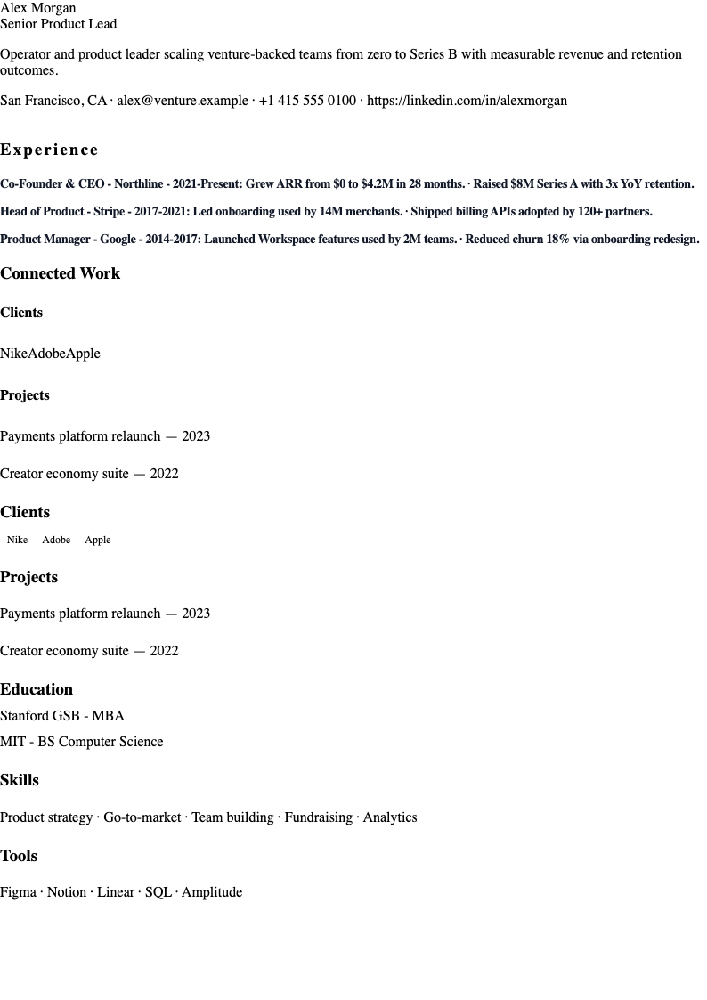
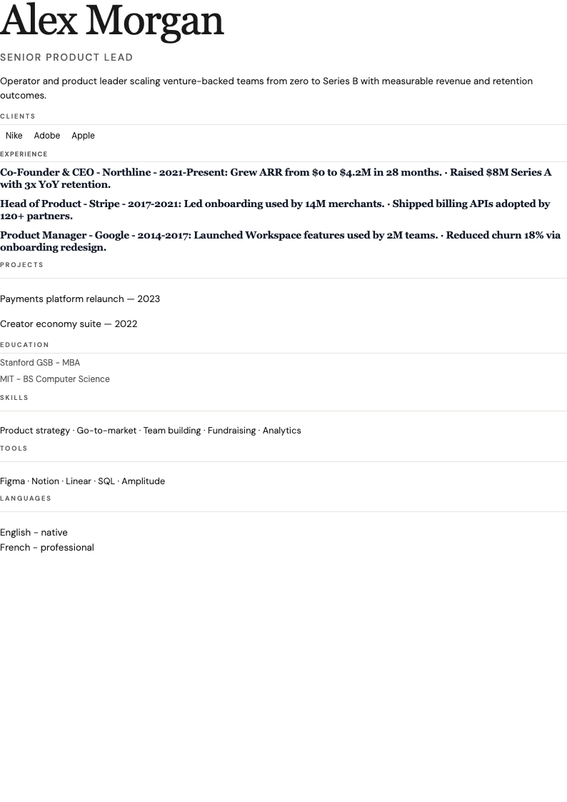
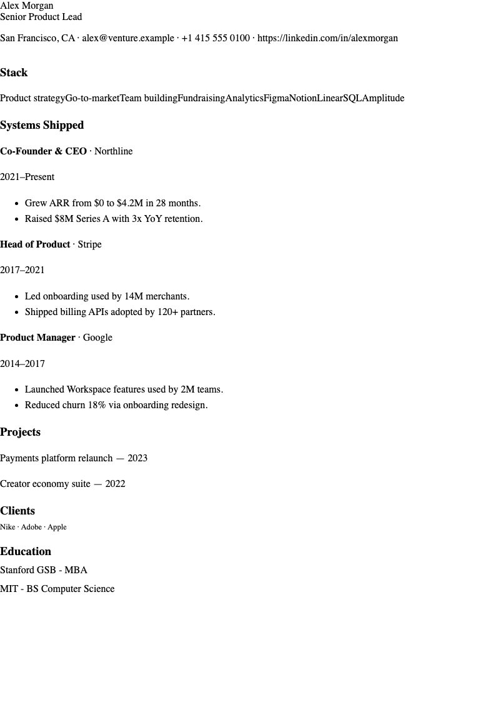
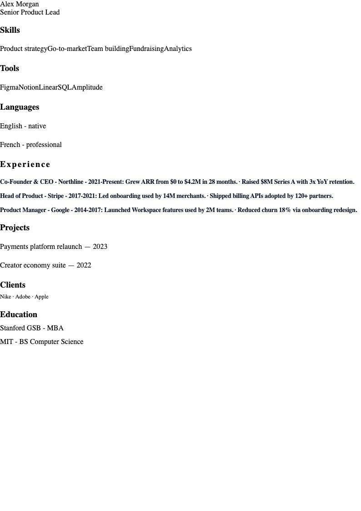
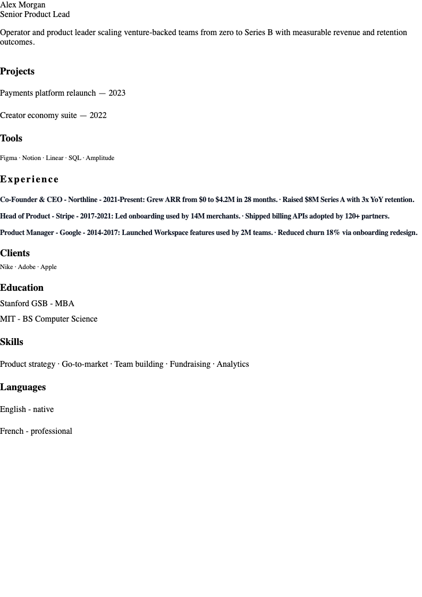
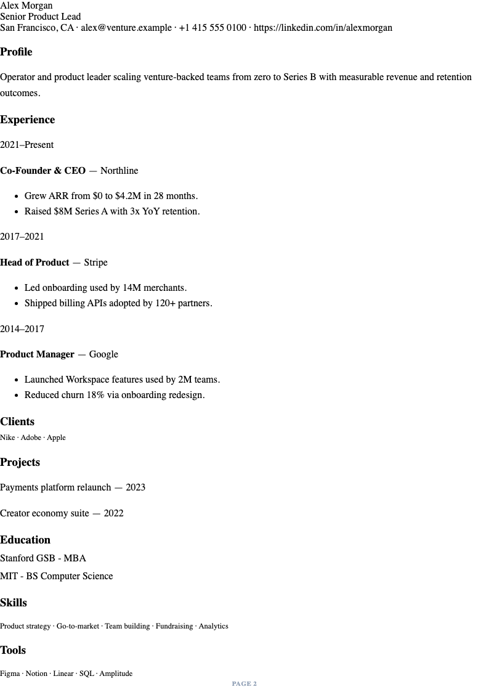
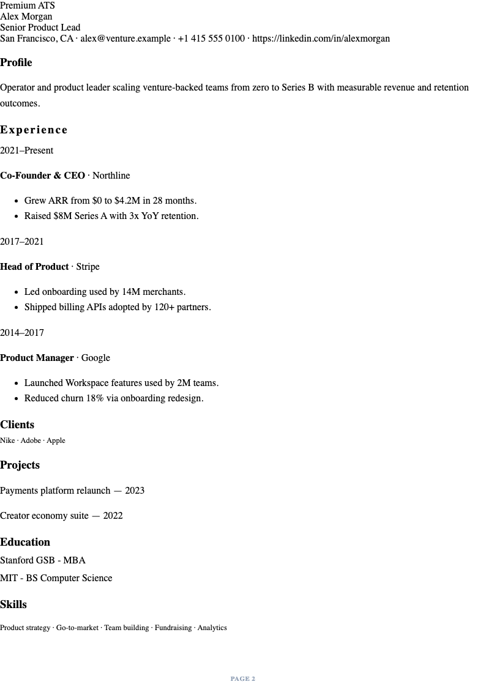

# Template System Audit

**Status:** PASS

**Engine:** `TEMPLATE_LIBRARY_V3`

**Generated:** 2026-06-15T23:15:59.743Z

**Score:** 10/10 templates pass A4 · no overflow · no empty sections · page-1 density

## Mission

Ten premium, role-specific CV templates that share one `cvData` / `finalResumeData` source. Each layout is structurally distinct — not a generic reskin.

## Requirements

| Requirement | Enforcement |
|-------------|-------------|
| Perfect A4 | 794×1123px preview = PDF export dimensions |
| No overflow | `overflow:hidden` + section `break-inside:avoid` + clip audit |
| No cut text | Completeness lock + empty-section gate |
| No layout jumps | Single render path · no post-render DOM mutation |
| Same cvData source | `resumeDataToTemplateView(SHARED_RESUME)` for all templates |

## Premium catalog (10)

| # | Category | Display name | ID | A4 | No empty | Page 1 | Result |
|---|----------|--------------|-----|:--:|:--------:|:------:|:------:|
| 01 | Executive | Executive | `executive-board` | ✓ | ✓ | ✓ | PASS |
| 02 | Consulting | Consulting | `consulting-elite` | ✓ | ✓ | ✓ | PASS |
| 03 | Startup | Startup | `startup-founder` | ✓ | ✓ | ✓ | PASS |
| 04 | Designer | Designer | `apple-style` | ✓ | ✓ | ✓ | PASS |
| 05 | Creative Director | Creative Director | `creative-director` | ✓ | ✓ | ✓ | PASS |
| 06 | Engineer | Engineer | `senior-engineer` | ✓ | ✓ | ✓ | PASS |
| 07 | Product Manager | Product Manager | `google-style` | ✓ | ✓ | ✓ | PASS |
| 08 | Marketing | Marketing | `luxury-editorial` | ✓ | ✓ | ✓ | PASS |
| 09 | Minimal ATS | Minimal ATS | `minimal-ats` | ✓ | ✓ | ✓ | PASS |
| 10 | Premium ATS | Premium ATS | `premium-ats` | ✓ | ✓ | ✓ | PASS |

## Data contract

All templates render from the same structured payload:

```javascript
resumeDataToTemplateView(SHARED_RESUME) → HirelyTemplates.render(view, templateId)
```

Fields consumed: identity, summary, experiences, education, skills, tools, languages, clients, projects.

## Screenshots

### 01 Executive — Executive



| Spec | Value |
|------|-------|
| Template ID | `executive-board` |
| Grid | Centered board masthead · single narrative · gold rule |
| Typography | Source Serif 4 · IBM Plex Sans · gold hairline · slate ink |
| A4 width | 794px (target 794) |
| Page-1 fill | 87.5% |
| Empty sections | 0 |
| Completeness | 100/100 |

### 02 Consulting — Consulting



| Spec | Value |
|------|-------|
| Template ID | `consulting-elite` |
| Grid | 3/9 asymmetric split · KPI strip · impact matrix footer |
| Typography | Cormorant Garamond display · IBM Plex Sans body · navy ink |
| A4 width | 794px (target 794) |
| Page-1 fill | 92.5% |
| Empty sections | 0 |
| Completeness | 100/100 |

### 03 Startup — Startup



| Spec | Value |
|------|-------|
| Template ID | `startup-founder` |
| Grid | Venture hero · traction metrics · 24/76 operator split |
| Typography | Inter 800 display · Linear purple · mono metrics |
| A4 width | 794px (target 794) |
| Page-1 fill | 73.5% |
| Empty sections | 0 |
| Completeness | 93/100 |

### 04 Designer — Designer



| Spec | Value |
|------|-------|
| Template ID | `apple-style` |
| Grid | Centered monument · left timeline spine · 56px margins |
| Typography | SF Pro–style Inter · 36pt name · -0.04em tracking · hairline rules |
| A4 width | 794px (target 794) |
| Page-1 fill | 91.9% |
| Empty sections | 0 |
| Completeness | 93/100 |

### 05 Creative Director — Creative Director



| Spec | Value |
|------|-------|
| Template ID | `creative-director` |
| Grid | Hero band · 3-col client proof · asymmetric case stack |
| Typography | Fraunces display · DM Sans UI · warm coral accent |
| A4 width | 794px (target 794) |
| Page-1 fill | 69.3% |
| Empty sections | 0 |
| Completeness | 93/100 |

### 06 Engineer — Engineer



| Spec | Value |
|------|-------|
| Template ID | `senior-engineer` |
| Grid | 20/80 mono rail · dense experience cards · stack blocks |
| Typography | JetBrains Mono accents · Inter body · GitHub-style density |
| A4 width | 794px (target 794) |
| Page-1 fill | 85.0% |
| Empty sections | 0 |
| Completeness | 89/100 |

### 07 Product Manager — Product Manager



| Spec | Value |
|------|-------|
| Template ID | `google-style` |
| Grid | 4-color accent bar · 26/74 skills rail · systems column |
| Typography | Product Sans headings · multi-hue bar · roadmap rhythm |
| A4 width | 794px (target 794) |
| Page-1 fill | 68.0% |
| Empty sections | 0 |
| Completeness | 89/100 |

### 08 Marketing — Marketing



| Spec | Value |
|------|-------|
| Template ID | `luxury-editorial` |
| Grid | Magazine cover · 22/48/30 three-column spread |
| Typography | Playfair Display · Lora body · tracked small caps |
| A4 width | 794px (target 794) |
| Page-1 fill | 74.8% |
| Empty sections | 0 |
| Completeness | 93/100 |

### 09 Minimal ATS — Minimal ATS



| Spec | Value |
|------|-------|
| Template ID | `minimal-ats` |
| Grid | Single column · 68ch · utility contact band · date grid |
| Typography | Inter · 8pt labels · tabular nums · pure black/white |
| A4 width | 794px (target 794) |
| Page-1 fill | 98.2% |
| Empty sections | 0 |
| Completeness | 100/100 |

### 10 Premium ATS — Premium ATS



| Spec | Value |
|------|-------|
| Template ID | `premium-ats` |
| Grid | Indigo recruiter band · dual-column experience grid · parse ribbon |
| Typography | Inter · tabular nums · indigo accent · recruiter labels |
| A4 width | 794px (target 794) |
| Page-1 fill | 92.3% |
| Empty sections | 0 |
| Completeness | 100/100 |


## Files

| File | Role |
|------|------|
| `src/ui/templates/template-families-v3.mjs` | 10-template catalog + categories |
| `src/ui/templates/cv-templates.js` | Layout render functions |
| `src/ui/templates/cv-templates-v3-families.css` | Per-template typography + grid |
| `scripts/template-system-audit-report.mjs` | Screenshot + audit generator |

## Regenerate

```bash
npm run template-system-audit-report
npm run qa:ten-premium-templates
```
